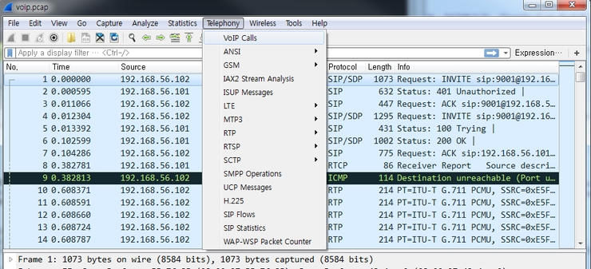
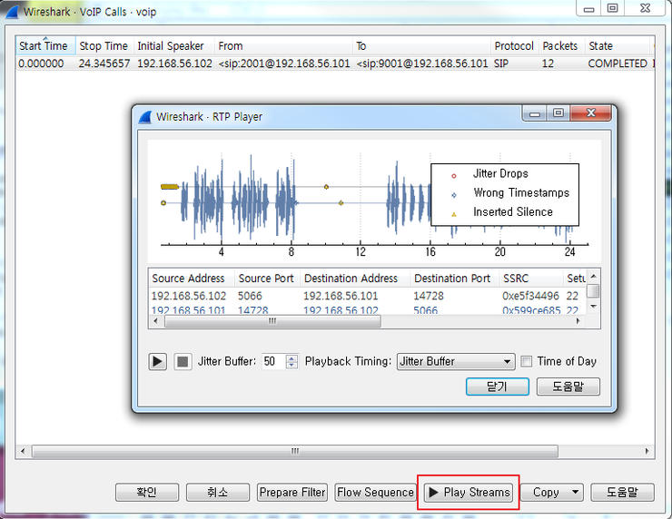

==============================================================
[2016_seccon] [Forensic] VoIP
==============================================================

문제내용
==============================================================

VoIP Extract a voice. The flag format is SECCON{[A-Z0-9]}.

문제 풀이
==============================================================

pcap파일을 제공하는데 VoIP를 위한 SIP 프로토콜을 확인할 수 있다. VoIP Calls를 선택해보자.

VoIP Calls를 선택하면 스트림을 직접 들어볼 수 있다. Play Streams를 통해 플래그값을 확인할 수 있다.

