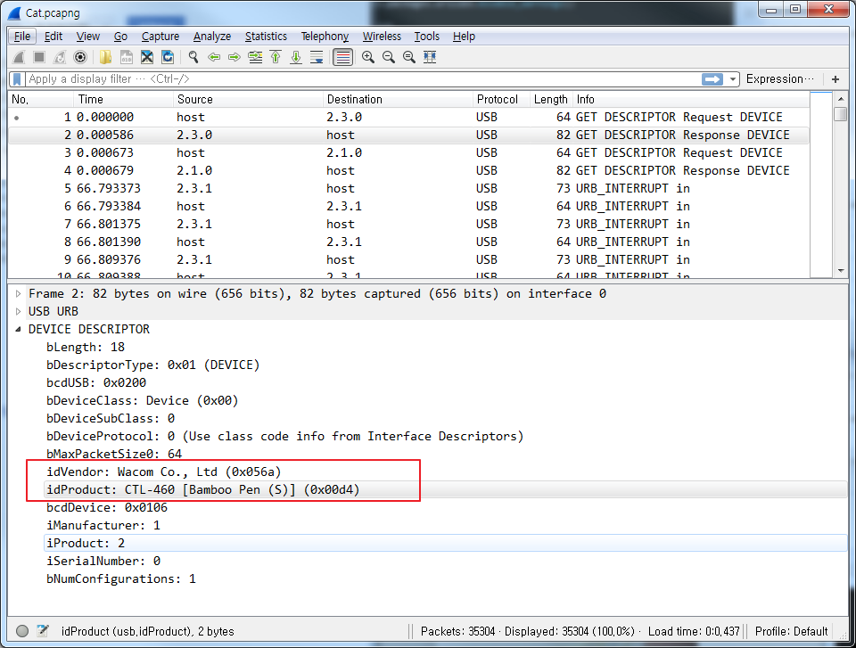

==============================================================
[2017_bitctf] [Forensic] Tom and Jerry
==============================================================

문제내용
==============================================================

cat.pcapng 파일이 제공. 해당 pcap에서 플래그를 찾는 문제

문제 풀이
==============================================================

pcap을 열어서 확인해보면 USB 데이터가 캡쳐된 것을 확인할 수 있음.

빨간색 박스 내용을 보면 idVendor와 idProduct를 확인할 수 있다.
해당 USB는 Bamboo Pen이라고 적힌걸로 보아 터치 터치펜인 것으로 보임.
Bamboo Pen의 이벤트 패킷(URB/USB Request Blocks)은 9바이트로 다음과 같은 포맷을 가지고 있음.

http://linuxwacom.sourceforge.net/wiki/index.php/USB_Protocol
 
간지나게 tshark로 pcap을 필터링 해보자!! 

.. code-block:: console
  
    $ tshark -r Cat.pcapng -T fields -e usb.capdata -Y usb.capdata > usbcapdata.txt
 
    추출한 결과는 다음과 같다.
    02:80:00:00:00:00:00:00:00
    02:80:00:00:00:00:00:00:00
    02:80:00:00:00:00:00:00:00
    02:80:00:00:00:00:00:00:00
    02:80:00:00:00:00:00:00:00
    ......
 
 
X좌표와 Y좌표를 통해 터치펜 포인터의 행위를 확인할 수 있다.
X좌표는 빨간색 부분을 바이너리로 전환하면 되고, Y좌표는 파란색 부분을 바이너리로 전환하면된다.
python 라이브러리 중 Matplotlib을 이용하여 해당 좌표값으로 이미지를 출력해보자.
Pressure가 있는 값의 경우 가시성을 떨어뜨릴 수 있으므로, 제외하고 출력

.. code-block:: python
  
    f=open('usbcapdata.txt',"rb")
    usbcapdata=f.readlines()
    f.close()
    coord=[[],[]]
    for line in usbcapdata:
        if line.split(':')[6]!="00" and line.split(':')[7]!="00":
            coord[0].append(line.split(':')[3] + line.split(':')[2])
            coord[1].append(line.split(':')[5] + line.split(':')[4])
    x=[]
    y=[]
    for n in range(0, len(coord[0])):
        x.append(int(coord[0][n],16))
        y.append(int(coord[1][n],16))
    import matplotlib.pyplot as plt
    plt.plot(x, y)
    plt.show()
    

    
    
    
    
