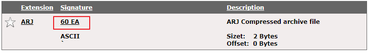
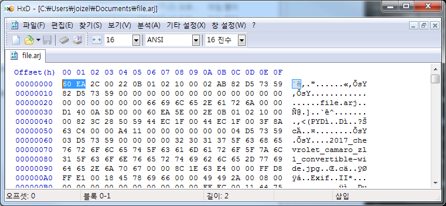
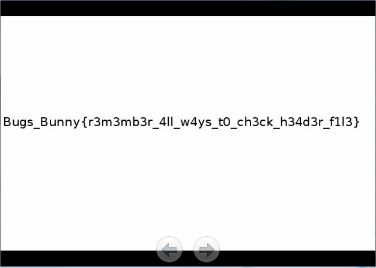

==============================================================
[2017_bugs_bunny] [Forensic] Lost data
==============================================================

문제내용
==============================================================

what`s going on here? i didn`t find anything important here, can you help me?
https://drive.google.com/file/d/0B4uKSYzbAEkWbG5iWjBzVWFFUEU/view?usp=sharing
Author: Aymen Borgi

문제 풀이
==============================================================

다운받은 파일을 확인한 결과 data 형식이다.

.. code-block:: console

    $ file file
    file: data

일단 strings로 확인해본 결과, 다음과 같은 3개의 파일 존재를 확인할 수 있었다.

.. code-block:: console

    $ strings -n7 file|grep '\w\.\w\w\w$'
    file.arj
    2017_chevrolet_camaro_zl1_convertible-wide.jpg
    flag.png

foremost를 이용해서 카빙할 경우 jpg만 뽑게되고, png를 확인할 수 없었다. 

.. code-block:: console

    $ foremost file
    Processing: file
    |*|

    $ ls -R output/
    output/:
    audit.txt  jpg

    output/jpg:
    00000000.jpg

위에서 해당 파일 형식이 data라고 되어 있었으나, 해당 파일 헤더가 수정되어 있는 것으로 보이며, arj 파일 형식으로 변경 후 압축 해제를 진행해보자.

파일 헤더를 arj 형식으로 변경

압축 해제 후 png 파일에서 flag 획득

