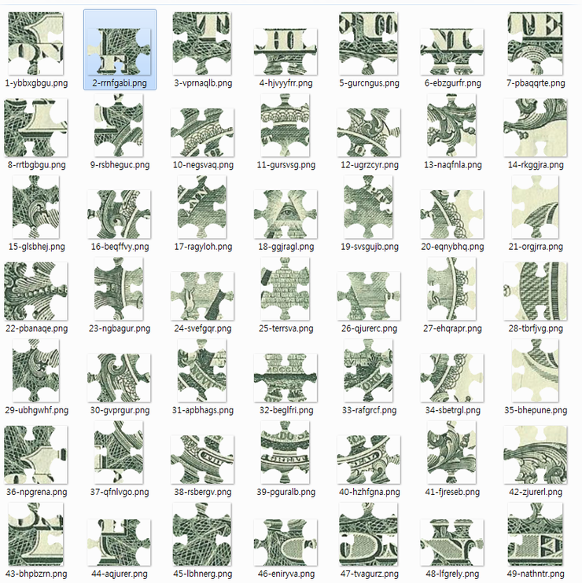

==============================================================
[2017_ctfzone] [Forensic] PUZZLE
==============================================================

문제내용
==============================================================

No victory can dispense with mighty patron, hence the more powerful your supporter is the better. Yesterday you finally managed to get in contact with one secret society. It seems that they might back your candidate if you accomplish the task they sent you as a rite of passage. You may find it easy at first glance but I wouldn’t be so naive…

문제 풀이
==============================================================

gzip으로 압축된 리눅스 파일 시스템을 하나 준다. fsck로 확인해보니 19만개 가량의 파일을 가지고 있다.

.. code-block:: console

    $ file trial.img
    trial.img: Linux rev 1.0 ext2 filesystem data, UUID=ec9143af-5a9c-4a45-8475-7a73956f2f83 (large files)
 
    $ fsck.ext2 trial.img
    e2fsck 1.42.13 (17-May-2015)
    trial.img: clean, 186842/190080 files, 202630/220160 blocks
 
해당 파일 시스템을 마운트해서 파일 내용을 확인해보자

.. code-block:: console

    $ sudo mount trial.img trial_img/

마운트시킨 후 /home/trial 폴더에 파일을 확인해보니 Desktop에 의심스러운 파일들이 존재한다.

.. code-block:: console

    $ ls -R home/trial
    home/trial:
    Desktop Documents Downloads Music Pictures Public Templates Videos
 
    home/trial/Desktop:
    beglfri layout.png translate.txt
 
    home/trial/Documents:
 
    home/trial/Downloads:
 
    home/trial/Music:

    home/trial/Pictures:

    home/trial/Public:

    home/trial/Templates:

    home/trial/Videos:

파일을 확인해보니 beglfri는 png파일로 퍼즐 조각이고, layout.png는 해당 그 조각의 위치를 표현하는 것으로 보인다.

    
.. image:: ../_images/0804-10.png
    :align: center

translate.txt는 무언가 퍼즐로 나온 문자열에 대한 해석을 해주는 것으로 보인다.

.. code-block:: console

    1080 = qO
    10th = $$
    1st = Th
    2 = O8
    2d = fT
    2nd = oc
    3d = 9$
    3m = 9w
    3rd = @D
    4gl = Ud
    4h = Mx
    4th = 3b
    .......
 
먼저 beglfri 와 같은 퍼즐 조각을 파일 시스템 내에서 찾기 위해 조건을 생각해본다. 
수정 날짜 및 시간은 모두 동일하기 때문에, 용량과 확장자가 없는 파일을 조건으로 find 진행

.. code-block:: console

    $ ls -al
    total 6643
    drwxr-xr-x 2 root root 1024 Jul 4 04:20 .
    drwxr-xr-x 21 root root 1024 Jul 4 04:20 ..
    -rw------- 1 root root 33390 Jul 4 04:20 beglfri
    -rwxr--r-- 1 root root 3055 Jul 4 04:20 layout.png
    -rwxr--r-- 1 root root 6734317 Jul 4 04:20 translate.txt

    $ sudo find /home/joizel/ctf_test/trial_img/ -type f ! -name "*.*" -size +20k -size -40k -exec cp {} extract_file \;

해당 조건이 만족하는 파일들을 한 폴더에 복사한 후, PNG 파일인 것만 개수를 확인해보니 49개 인것으로 보아 최초에 추측한 게 맞는 것으로 보인다.

.. code-block:: console

    $ sudo file *|grep PNG|wc -l
    49

해당 파일을 다른 폴더에 옮기고, png 확장자를 추가해준다. 파일을 옮기는 건 49개 일일이 옮기기 귀찮아서 bash 스크립트를 짯음

.. code-block:: console

    #!/bin/bash
    list=`file * |grep PNG|awk -F: '{print $1}'`
    for file in `echo $list`
    do
        `cp $file png_extract`
    done
 
png 확장자 추가

.. code-block:: console

    $ rename "s/$/.png/" *

이 후, 퍼즐 조각을 그림에 맞춰보니 1달러의 일부분 인것으로 보인다.

각 퍼즐 조각의 파일명을 순서대로 나열하면 다음과 같다.

.. code-block:: console

    ybbxgbgu rrnfgabi vprnaqlb hjvyyfrr gurcngus ebzgurfr pbaqqrte	
    rrtbgbgu rsbheguc negsvaq  gursvsg  ugrzcyr  naqfnla  rkggjra	
    glsbhej  beqffvy  ragyloh  ggjragl  svsgujb  eqnybhq  orgjrra	
    pbanaqe  ngbagur  svefgqr  terrsva  qjurerc  ehqrapr  tbrfjvg	
    ubjgwhf  gvprgur  apbhags  begifri  rafgrcf  sbetrgl  bhepune	
    npgrena  qfnlvgo  rsbergv  pguralb  hzhfgna  fjreseb  zjurerl	
    bhpbzrn  aqjurer  lbhnerg  eniryva  tvagurz  lfgrely  nathntr

rot13으로 디코딩하면 다음과 같다.

.. code-block:: console

    look to the east novice
    and you will see the path from the second degree
    go to the fourth part
    find the fifth temple
    and say next twenty four words silently
    but twenty fifth word aloud between con and rat

    on the first degree
    find where prudence goes with out justice
    then count forty seven steps
    forget your character and say it before tic
    then you must answer from where you come and where you are traveling in the mystery language

그 다음 부터는 구글링하고 관련 정보를 찾는 부분으로 보이나, 시간 관계상 패스...

