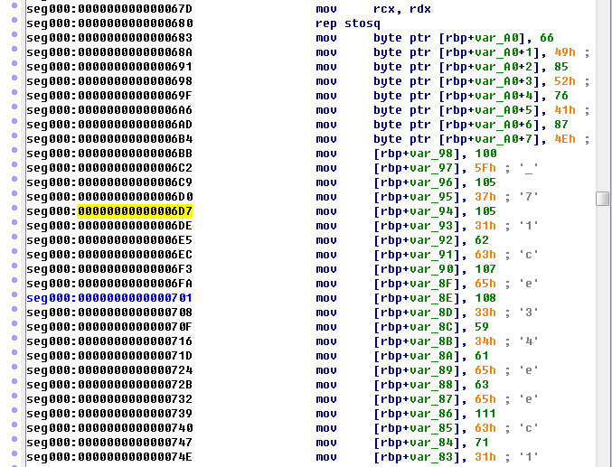

=====================================================================
[asisctf] memdump
=====================================================================

메모리 덤프 파일 정보 확인
=====================================================================

메모리 덤프 파일의 정보를 확인합니다.

리눅스 메모리 덤프의 경우 volatility의 imageinfo로 확인을 하게 되면 시간도 오래걸리고, 만약 profile에 해당 이미자가 없을 수 있기 때문에 다음 명령으로 확인을 합니다.

.. code-block:: console

    $ strings ~/out2/mem.dump | egrep '^Linux.*[0-9.]{3,}.*SMP'
 
    Linux version 3.5.0-23-generic (buildd@komainu) (gcc version 4.6.3 (Ubuntu/Linaro 4.6.3-1ubuntu5) ) #35~precise1-Ubuntu SMP Fri Jan 25 17:13:26 UTC 2013 (Ubuntu 3.5.0-23.35~precise1-generic 3.5.7.2)
     
    Linux version 3.5.0-23-generic (buildd@komainu) (gcc version 4.6.3 (Ubuntu/Linaro 4.6.3-1ubuntu5) ) #35~precise1-Ubuntu SMP Fri Jan 25 17:13:26 UTC 2013 (Ubuntu 3.5.0-23.35~precise1-generic 3.5.7.2)

|

프로세스 정보 확인
=====================================================================

위에서 나온 프로파일이 윈도우이므로, pslist로 프로세스 정보에 대해 확인합니다.

.. code-block:: console

   $ python vol.py linux_psaux --profile=LinuxUbuntu1210x64 -f ~/out2/mem.dump

    Volatility Foundation Volatility Framework 2.5

    Pid    Uid    Gid    Arguments

    [......중략......]
    816    0      0      acpid -c /etc/acpi/events -s /var/run/acpid.socket
    819    0      0      cron
    820    0      0      atd
    837    0      1000   /bin/login --
    967    1000   1000   -bash
    8111   0      0      /sbin/udevd --daemon
    8112   0      0      /sbin/udevd --daemon
    9425   1000   1000   ./asis-ctf                     <-- suspicious process
    15584  1000   1000   nano print.cpp
    15629  0      0      [kworker/0:0]
    16346  0      0      /usr/sbin/apache2 -k start
    16349  33     33     /usr/sbin/apache2 -k start 
    16350  33     33     /usr/sbin/apache2 -k start
    16351  33     33     /usr/sbin/apache2 -k start
    16783  0      0      [kworker/0:1] 
    16784  0      0      [kworker/0:2]

|

수상한 프로세스 덤프
=====================================================================

여기서는 uid와 gid가 1000인 pid가 9425 asisctf가 보이네요. 덤프떠봅시다.

수상한 프로세스를 pid로 따로 덤프를 떠 확인합니다.

.. code-block:: console

    $ sudo python vol.py --profile=LinuxUbuntu1210x64 -f ~/out2/mem.dump -p 9425 linux_dump_map -D .

    Volatility Foundation Volatility Framework 2.5
     
    Task       VM Start           VM End                         Length Path
    ---------- ------------------ ------------------ ------------------ ----
    9425 0x0000000000400000 0x0000000000401000             0x1000 ./task.9425.0x400000.vma
    9425 0x0000000000600000 0x0000000000601000             0x1000 ./task.9425.0x600000.vma
    9425 0x0000000000601000 0x0000000000602000             0x1000 ./task.9425.0x601000.vma
    9425 0x00007fd496e34000 0x00007fd496fe9000           0x1b5000 ./task.9425.0x7fd496e34000.vma
    9425 0x00007fd496fe9000 0x00007fd4971e8000           0x1ff000 ./task.9425.0x7fd496fe9000.vma
    9425 0x00007fd4971e8000 0x00007fd4971ec000             0x4000 ./task.9425.0x7fd4971e8000.vma
    9425 0x00007fd4971ec000 0x00007fd4971ee000             0x2000 ./task.9425.0x7fd4971ec000.vma
    9425 0x00007fd4971ee000 0x00007fd4971f3000             0x5000 ./task.9425.0x7fd4971ee000.vma
    9425 0x00007fd4971f3000 0x00007fd497215000            0x22000 ./task.9425.0x7fd4971f3000.vma
    9425 0x00007fd497408000 0x00007fd49740b000             0x3000 ./task.9425.0x7fd497408000.vma
    9425 0x00007fd497411000 0x00007fd497415000             0x4000 ./task.9425.0x7fd497411000.vma
    9425 0x00007fd497415000 0x00007fd497416000             0x1000 ./task.9425.0x7fd497415000.vma
    9425 0x00007fd497416000 0x00007fd497418000             0x2000 ./task.9425.0x7fd497416000.vma
    9425 0x00007fff62ff0000 0x00007fff63012000            0x22000 ./task.9425.0x7fff62ff0000.vma
    9425 0x00007fff63048000 0x00007fff63049000             0x1000 ./task.9425.0x7fff63048000.vma

|

덤프 파일 분석
=====================================================================

file명령으로 확인해보니 truncated 된 파일이 존재하는데, IDA pro에서 바이너리 형식으로 열어보겠습니다. 

.. code-block:: console

    $ file *

    task.9425.0x400000.vma:       data
    task.9425.0x600000.vma:       ELF 64-bit LSB  executable, x86-64, version 1 (SYSV), dynamically linked (uses shared libs), stripped
    task.9425.0x601000.vma:       data
    task.9425.0x7fd496e34000.vma: ELF 64-bit LSB  shared object, x86-64, version 1 (SYSV), dynamically linked (uses shared libs), stripped
    task.9425.0x7fd496fe9000.vma: data
    task.9425.0x7fd4971e8000.vma: data
    task.9425.0x7fd4971ec000.vma: data
    task.9425.0x7fd4971ee000.vma: data
    task.9425.0x7fd4971f3000.vma: ELF 64-bit LSB  shared object, x86-64, version 1 (SYSV), dynamically linked, stripped
    task.9425.0x7fd497408000.vma: AmigaOS bitmap font
    task.9425.0x7fd497411000.vma: data
    task.9425.0x7fd497415000.vma: data
    task.9425.0x7fd497416000.vma: data
    task.9425.0x7fff62ff0000.vma: data
    task.9425.0x7fff63048000.vma: ELF 64-bit LSB  shared object, x86-64, version 1 (SYSV), dynamically linked, BuildID[sha1]=30a64f87863f905f75134416f658d8817843cfb5, stripped
     
    $ objdump -D ./task.9425.0x600000.vma

    objdump: ./task.9425.0x600000.vma: File truncated

내용을 뒤지다 보니 다음과 같이 문자열을 저장하는 명령이 보이고 문자열 입력 값이 보입니다.

이 입력값을 계산하는 부분은 다음과 같습니다. 

(여기서 [rbp+var_A4] 부분이 for문에 들어가는 변수 i라고 보면 되겠습니다.)

.. code-block:: c

    mov     [rbp+var_A4], 0          ; i=0
    jmp     short loc_893

    loc_867:
     
    mov     eax, [rbp+var_A4]        ; eax = i
    add     eax, eax                 ; i = i+i = 2*i
    cdqe
    movzx   eax, byte ptr [rbp+rax+var_A0] ; 문자열 가져옴 table[i]
    movsx   eax, al
    sub     eax, [rbp+var_A4]        ; -i
    sub     eax, 1                   ; -1
    mov     edi, eax
    call    sub_500                  ; 출력 함수인것으로 유추
    add     [rbp+var_A4], 1          ; i = i +1
     
    loc_893: 

    cmp     [rbp+var_A4], 36         ; i = 36 일때 까지 for문
    setle  
    test    al, al
    jnz     short loc_867       
 

계산 하는 부분을 python으로 코딩해서 풀어봅시다.

.. code-block:: python

    table_s = """42 49 55 52 4c 41 57 4e 64 5f 69 37 69 31 3e 63
    6b 65 6c 33 3b 34 3d 65 3f 65 6f 63 47 31 75 36 
    72 66 42 62 4a 65 75 39 49 66 48 34 4d 32 4a 34
    4e 37 4e 32 4d 35 55 65 50 37 82 32 84 61 52 35
    83 39 85 61 53 34 89 39 8b 64 26"""

    table = []     
    for c in table_s.replace("\n", " ").split(" "):
        n = int("0x" + c, 16)
        table.append(n)
     
    flag = ""
    for i in range(0,37):
        a = 2 * i
        c = table[a] - i - 1
        flag += chr(c)
     
    print flag
