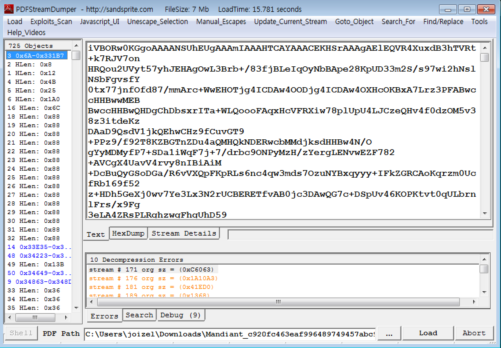

================================================================================
[2015_csaw] [MISC] Mandiant
================================================================================

일단 pdf를 받아서 열어보니 mandiant에서 작성한 pdf파일입니다.

PDFStreamDumper를 이용해서 해당 pdf를 열어보니 많은 오브젝트가 존재하는 것을 확인할 수 있습니다. 그 중 base64로 보이는 오브젝트가 확인됩니다.

base64값을 output.b64로 저장하고 해당 값을 디코드한 값의 헤더 부분을 확인해보니 이미지 파일인 것을 확인할 수 있습니다.

.. code-block:: console

    $ cat output.b64|tr -d '\n'|base64 -d|xxd|head

    0000000: 8950 4e47 0d0a 1a0a 0000 000d 4948 4452  .PNG........IHDR
    0000010: 0000 0262 0000 01d3 0806 0000 0084 2874  ...b..........(t
    0000020: ab00 0020 0049 4441 5478 5eec 5d07 7853  ... .IDATx^.].xS
    0000030: 551b 7e93 b449 57ba 271d 1428 bb65 15ca  U.~..IW.'..(.e..
    0000040: de7b ca12 441c 080e c0bd c1ad bfbf f377  .{..D..........w
    0000050: e304 b788 a8ec 8d6c 1029 7b6f 0aa5 40f7  .......l.){o..@.
    0000060: de6d 92fe cf7b c22d a136 c94d 49b1 60be  .m...{.-.6.MI.`.
    0000070: c7d8 d2dc 7bee 39df 39f7 7cef f9a6 02b7  ....{.9.9.|.....
    0000080: 3e5b 0107 3938 e0e0 8083 030e 0e38 38e0  >[..98.......88.
    0000090: e080 8303 0e0e 5c77 0e28 1c40 ecba f3dc  ......\w.(.@....

해당 파일을 이미지로 저장해보니 다음과 같습니다.

.. code-block:: console

    $ cat output.b64|tr -d '\n'|base64 -d > pic.png

|

binwalk를 통해 파일을 확인한 결과 7-zip으로 압축된 파일이 바인딩 되어 있는 걸 확인할 수 있습니다.

.. code-block:: console

    $ binwalk -e pic.png
    DECIMAL     HEX         DESCRIPTION
    ----------------------------------------------------------------------------------------
    0           0x0         PNG image, 610 x 467, 8-bit/color RGBA, non-interlaced
    160173      0x271AD     7-zip archive data, version 0.4

|

7z로 해당 일을 풀면 하나의 secret.txt라는 문서 파일이 하나 추출됩니다.

.. code-block:: console

    $ 7z x 271AD.zip 

    7-Zip [64] 9.20  Copyright (c) 1999-2010 Igor Pavlov  2010-11-18
    p7zip Version 9.20 (locale=ko_KR.UTF-8,Utf16=on,HugeFiles=on,1 CPU)

    Processing archive: 271AD.zip

    Extracting  secret.txt

    Everything is Ok

    Size:       58375
    Compressed: 43849

해당 파일 역시 base64로 인코딩되어 있어 확인하면 다음과 같습니다.

.. code-block:: console

    $ cat secret.txt |tr -d '\n' |base64 -d |xxd| head

    0000000: ffd8 ffdb 0043 0003 0202 0202 0203 0202  .....C..........
    0000010: 0203 0303 0304 0604 0404 0404 0806 0605  ................
    0000020: 0609 080a 0a09 0809 090a 0c0f 0c0a 0b0e  ................
    0000030: 0b09 090d 110d 0e0f 1010 1110 0a0c 1213  ................
    0000040: 1210 130f 1010 10ff db00 4301 0303 0304  ..........C.....
    0000050: 0304 0804 0408 100b 090b 1010 1010 1010  ................
    0000060: 1010 1010 1010 1010 1010 1010 1010 1010  ................
    0000070: 1010 1010 1010 1010 1010 1010 1010 1010  ................
    0000080: 1010 1010 1010 1010 1010 1010 ffc2 0011  ................
    0000090: 0801 1b01 4103 0122 0002 1101 0311 01ff  ....A.."........

해당 파일을 이미지로 저장해보니 다음과 같습니다.

.. code-block:: console

    $ cat secret.txt |tr -d '\n' |base64 -d > pic.jpg

|

다시 해당 이미지 파일에 strings값을 확인해보니 base64가 인코딩되어 있는 것을 확인할 수 있습니다.

.. code-block:: console

    $ strings -a pic.jpg | tail -n2 > strings.b64

Free File Camouflage
