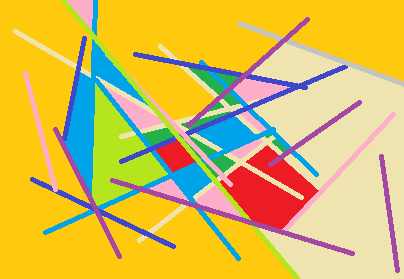
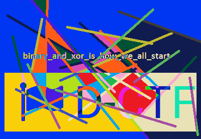

================================================================================
[defcamp] try harder
================================================================================

먼저 2개의 파일을 다운로드 할 수 있도록 되어 있네요.

1>misc200.part0.jpg.gz
2>part3.zip

1번째 파일은 압축을 푸니 확장자는 jpg로 되어있으나, x86 bootsector file이었고,
2번재 파일은 패스워드가 걸려있어서 압축이 안풀리네요. 

그럼 bootsector를 binwalk라는 Firmware Analysis Tool로 분석해봅니다.
※ 돌려보면 아시겠지만 시간이 엄청 오래걸립니다.

.. code-block:: bash

    $ binwalk -e misc200.jpg
    DECIMAL       HEXADECIMAL     DESCRIPTION
    --------------------------------------------------------------------------------
    362319872     0x15989000      Zip archive data, at least v2.0 to extract, compressed size: 106482,  uncompressed size: 106518, name: "emalware.042"
    503414784     0x1E018000      Zip archive data, at least v2.0 to extract, compressed size: 63746,  uncompressed size: 80643, name: "3pm.redrah-yrt"
    503478634     0x1E02796A      End of Zip archive

4개 파일이 떨궈진 것을 확인할 수 있습니다.

.. code-block:: bash

    $ ls _misc200.jpg.extracted
    15989000.zip  1E018000.zip  3pm.redrah-yrt  emalware.042

그 중에 3pm.redrah-yrt가 수상하네요. 파일명을 보니 문제 제목을 거꾸로 써놨네요.
먼저 이상한 파일일 경우에 항상 하는 게 있죠. strings~

.. code-block:: bash

    $ strings 3pm.redrah-yrt
    9TIT2
    try-harder.mp3COMM
    aHR0cDovL2RjdGYuZGVmLmNhbXAvX19kbmxkX18yMDE1X18vcGFydDEuaHRtbATXXX
    TRACKTOTAL
    TCOP
    TLAN
    TPUB
    Info
     "$(*+/1379;?@BFHJNPRUWY]_aegilnptvx|~
    ...(중략)....

먼가 저 strings가 수상한 냄새가 나네요.
base64로 디코딩을 한 결과 다음과 같은 주소가 나옵니다. (https://www.base64decode.org/)
http://dctf.def.camp/__dnld__2015__/part1.html

해당 주소로 접속하면 다음과 같은 텍스트를 떨굽니다.

.. code-block:: text

    Capture the       Flag (CTF)         is a special        kind     of information    security           competitions. There are   three common   types of CTFs: Jeopardy, Attack-Defence and mixed.  
    Jeopardy-style    CTFs has          a         couple of          questions         (tasks)   in           range of           categories.        For example,      Web,     Forensic,           Crypto, Binary or something       else. Team can    gain some points for every         solved task. More points for more complicated        tasks    usually.  The next task in chain can          be           opened only after some team      solve previous    task.     Then     the game time   is over sum          of        points shows you          a CTF winer. Famous example       of such CTF is Defcon CTF quals. 
    Well,     attack-defence is another interesting kind  of competitions.  Here     every team           has      own     network(or only one host)          with vulnarable services. Your team has time           for       patching your    services and developing  exploits usually.  So,           then organizers connects participants of   competition and the       wargame           starts! You should          protect  own red herring  for defence points and hack           opponents for attack      points.  Historically this is           a first type of     CTFs,           everybody knows about DEF CON CTF - something like a World Cup of all    other           competitions.    
    Mixed competitions may vary possible formats.      It         may be something like wargame           with special       time     for       task-based elements (like UCSB iCTF).
    CTF      games   often    touch on          many other aspects of information           security:           cryptography, stego, binary         analysis, reverse engeneering, mobile        security and      others.  Good    teams generally have      strong   skills     and      experience in     all these issues.     
    All        rights reserved   to ctftime.org
    Enjoy    this CTF and      get       in the final round!

먼가 tab과 띄어쓰기로 이루어져 있군요. (writeup을 보고 그러려니 하지만 이런걸 어떻게 유추하는거죠?)
띄어쓰기를 0으로 치환하고 tab을 1로 치환한 후 8비트씩 잘라봅니다.

.. code-block:: python

    x = open('part1.txt', 'rb').read()
    for i in range(256):
        if i==ord(' ') or i==ord('\t'):
            continue
        x=x.replace(chr(i), '')

    x = x.replace(' ','0')
    x = x.replace('\t','1')
    x = x +'0'
    print x
    n=""
    for l in range(len(x)/8):
        l = l*8
        m = x[l:l+8]
        n +=chr(int(m,2))
        print n

Second part in misc200part2.zip 라는 값이 뜨게 됩니다.

http://dctf.def.camp/__dnld__2015__/misc200part2.zip
해당 주소로 접속하여 misc200part2.zip 파일을 다운로드 받습니다.

다운 받은 파일을 압축 해제하면 다음과 같이 2개의 파일이 풀립니다.
일단 file1.bmp파일을 열어보니 그냥 이상한 그림 파일이군요. (여기에 패스워드가 있을 줄 알았는데.....)

뭔가 file2가 해결 실마리가 될거 같네요.

.. code-block:: bash

    $ ls -al
    -rw-rw-r-- 1 joizel joizel 338202 Oct  3 00:09 file1.bmp
    -rw-rw-r-- 1 joizel joizel 338202 Oct  3 00:19 file2

파일 크기가 같은 걸로 보아 뭔가 냄새가 나는군요.
hexdump로 헤더 부분을 확인해보니, file2의 헤더부분이 00으로 채워져있어, file1.bmp의 헤더 부분을 file2에 덮어씌어 보겠습니다.

아 패스워드가 드디어 나오네요.

binary_and_xor_is_how_we_all_start

이제 아까 암호 압축이 되어 있던 파일에 패스워드를 넣었더니 정상적으로 압축이 풀립니다.
압축이 풀리고 part3.jpg에 패스워드가 보이네요. 