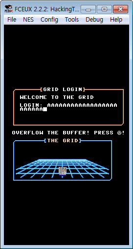
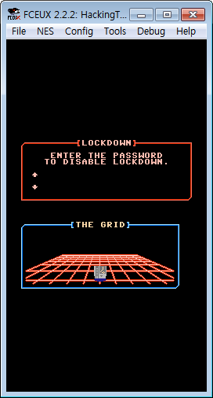
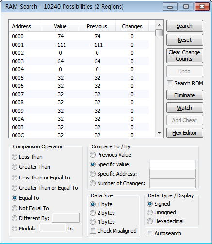
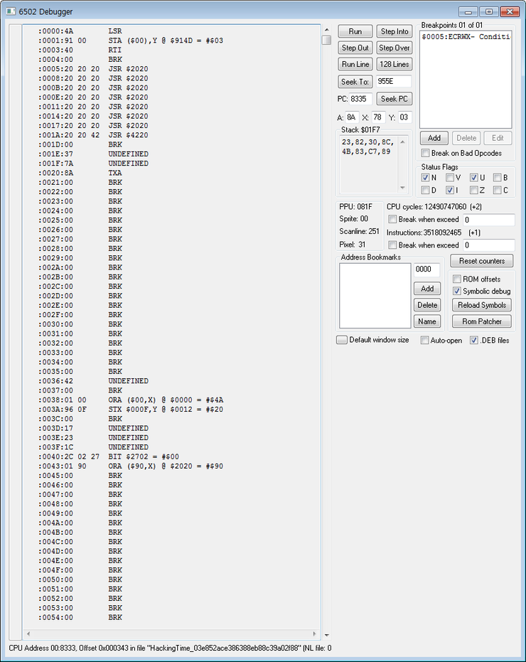
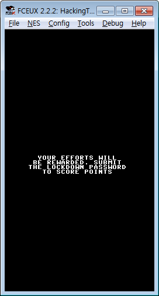

============================================================================================================
[CSAW] hacking time
============================================================================================================

Flow Chart
================================================================================================================

.. graphviz::

    digraph foo {
        a -> b -> c -> d -> e -> f -> g -> h -> i -> j -> k -> l -> m -> n -> o;
        
        a [shape=box, color=lightblue, label="FCEUX"];
        b [shape=box, label="load A $0005"];
        c [shape=box, label="X->A, 1bit rol (3 count)"];
        d [shape=box, label="PUSH A"];
        e [shape=box, label="load A $003B"];
        f [shape=box, label="X->A, 1bit ror (2 count)"];
        g [shape=box, label="save $003B"];
        h [shape=box, label="PULL A"];
        i [shape=box, label="CLC"];
        j [shape=box, label="A + $003B"];
        k [shape=box, label="A ^ $955E"];
        l [shape=box, label="save $003B"];
        m [shape=box, label="X->A, 1bit ror (4 count)"];
        n [shape=box, label="A ^ $9576"];
        o [shape=box, label="save $001E"];
    }

|

취약점 확인 (FCEUX 에뮬레이터)
============================================================================================================

fceux라는 에뮬레이터 디버거 툴이 있군요. 
일단 설치하고 돌렸더니 이상한 도로위를 달리는 PC가 나오네요. 
계속 F 버튼을 누르니까 버퍼 오버플로우 관련 화면이 나옵니다.

계속 누르니까 화면에서 Segmant Fault가 나면서 Lock Down 화면이 뜨네요.

|

Input 값 확인 (6502)
============================================================================================================

여기서 입력 값이랑 메모리에 있는 값과 compare를 해서 키값을 출력하게 하는 거 같습니다. 
글씨 입력 칸을 세보니 24칸입니다.

그럼 일단 입력 받는 부분이 어디인지 한번 봐야겠죠. 
이 툴의 사용법을 잘 모르니까 일단 RAM Search를 클릭해보니 그림과 같습니다.

입력 부분에 값을 화살표 위아래 버튼으로 고쳤더니 0005~001c까지 32(Dec)로 되어있는 것을 볼 수 있습니다.
일단 Debugger 기능을 실행해보니 어셈블리 코드가 6502 프로세스로 되어있는데 무슨 말인지 하나도 모르겠네요. 

대충 중요해보이는 어셈블리 언어만 구글링해봅니다.

.. code-block:: javascript

    BNE = Branch on Result not Zero
    EOR = XOR Memory with Accumulator
    LDA = Load Accumulator with Memory
    STA = Store Accumulator in Memory
    CPY = Compare Memory with Index Y
    TAX = Transfer Accumulator to Index X(A->X)
    TXA = Transfer Index X to Accumulator(X->A)
    ROL = Rotate Left One Bit(C <- 7 6 5 4 3 2 1 0 <- C)
    ROR = Rotate Right One Bit(C -> 7 6 5 4 3 2 1 0 -> C)
    PHA = Push Accumulator on Stack(A->S)
    PLA = Pull Accumulator from Stack
    ADC = Add Memory to Accumulator with Carry

일단 $0005를 입력값으로 받기 때문에 거기에 브레이크포인트를 걸고, 프로그램 상에서 f(확인)을 눌러 어떤식으로 변화가 이어지는 지 보도록 하겠습니다.

확인 결과 입력값에서 24번 for문을 돌면서 뭔가 인코딩을 하는 것으로 보입니다.

.. code-block:: c

    82F7   LDA $0005,Y // $0005 A에 로드
    82FA   TAX // A->X
    82FB   ROL // 1bit 왼쪽으로 이동
    82FC   TXA // X->A
    82FD   ROL // 1bit 왼쪽으로 이동
    82FE   TAX // A->X
    82FF   ROL // 1bit 왼쪽으로 이동
    8300   TXA // X->A
    8301   ROL // 1bit 왼쪽으로 이동
    8302   TAX // A->X
    8303   ROL // 1bit 왼쪽으로 이동
    8304   TXA // X->A
    8305   ROL // 1bit 왼쪽으로 이동
    8306   PHA // PUSH A
    8307   LDA $003B // $003B A에 로드
    8309   TAX // A->X
    830A   ROR // 1bit 오른쪽으로 이동
    830B   TXA // X->A
    830C   ROR // 1bit 오른쪽으로 이동
    830D   TAX // A->X
    830E   ROR // 1bit 오른쪽으로 이동
    830F   TXA // X->A
    8310   ROR // 1bit 오른쪽으로 이동
    8311   STA $003B // $003B 저장
    8313   PLA // PULL A
    8314   CLC
    8315   ADC $003B // A + $003B
    8317   EOR $955E,Y // A xor $955E
    831A   STA $003B // $003B 저장
    831C   TAX // A->X
    831D   ROL // 1bit 왼쪽으로 이동
    831E   TXA // X->A
    831F   ROL // 1bit 왼쪽으로 이동
    8320   TAX // A->X
    8321   ROL // 1bit 왼쪽으로 이동
    8322   TXA // X->A
    8323   ROL // 1bit 왼쪽으로 이동
    8324   TAX // A->X
    8325   ROL // 1bit 왼쪽으로 이동
    8326   TXA // X->A
    8327   ROL // 1bit 왼쪽으로 이동
    8328   TAX // A->X
    8329   ROL // 1bit 왼쪽으로 이동
    832A   TXA // X->A
    832B   ROL // 1bit 왼쪽으로 이동
    832C   EOR $9576,Y // A xor $9576
    832F   STA $001E,Y // $001E 저장
    8332   INY // Y+1
    8333   CPY #$18 // Y와 #$18(24) 비교(같으면 0)
    8335   BNE $82F7 // 결과가 0이 아니면 82F7로 점프 
    8337   LDY #$00 // #$00 로드 
    8339   LDA $001E,Y // $001E A에 로드
    833C   BNE $8346 // 결과가 0이 아니면 8346로 점프 
    833E   INY
    833F   CPY #$18
    8341   BNE $8339

|

ASM2PYTHON
============================================================================================================

어셈코드를 보니 일단 Input값에 계산식을 써서 값이 0으로 도출되면 인증이 통과되는 형식임을 확인할 수 있습니다.
이제 이 소스를 우리가 보기 편한 python코드로 하나씩 수정해봅시다.

.. code-block:: python

    Code_Length = 0x18
    mem_955e = [0x70, 0x30, 0x53, 0xa1, 0xd3, 0x70, 0x3f, 0x64,
                        0xb3, 0x16, 0xe4, 0x04, 0x5f, 0x3a, 0xee, 0x42,
                        0xb1, 0xa1, 0x37, 0x15, 0x6e, 0x88, 0x2a, 0xab]
    mem_9576 = [0x20, 0xac, 0x7a, 0x25, 0xd7, 0x9c, 0xc2, 0x1d,
                        0x58, 0xd0, 0x13, 0x25, 0x96, 0x6a, 0xdc, 0x7e,
                        0x2e, 0xb4, 0xb4, 0x10, 0xcb, 0x1d, 0xc2, 0x66]

    def add(x,y):
        return 0xff & (x+y)

    def rol(x):
        return 0xff & ((x<<1)|(x>>7))

    def ror(x):
        return 0xff & ((x>>1)|(x<<7))

    def encode(cipher):
        a, x = 0, 0
        tmp = 0        # Stack
        mem_003b = a
        mem_001e = []
        m = []
        for y in range(Code_Length):
            a= cipher[y]                 # LDA $0005,Y
            x= a = rol(rol(rol(a)))      # TXA, ROL (3 count)
            tmp= a                       # PHA
            a= mem_003b                  # LDA $003B
            x= a = ror(ror(a))           # TXA, ROR (2 count)
            mem_003b = a                 # STA $003B
            a= tmp                       # PLA
                                         # CLC
            a= add(a, mem_003b)          # ADC $003B
            a= a ^ mem_955e[y]           # EOR $955E, Y
            mem_003b = a                 # STA $003B
            x= a = rol(rol(rol(rol(a)))) # TXA, ROR 4 count
            a= a ^ mem_9576[y]           # EOR $9576, Y
            mem_001e.append(a)           # STA $001E, Y
            m.append(mem)

|

이 코드에서 mem_001e 리스트 값에 0x00이 들어가야 통과를 할 수 있습니다. 실제로 0x001e~0x0037 부분을 00으로 덮어쓰면 통과되는 화면을 볼 수 있습니다. 하지만 지금 풀어야할 숙제는 실제 00값이 나오게 하기 위한 입력값을 찾아야하기 때문에 위 python코드를 디코딩 코드로 변환해야합니다.

|

디코딩 코드로 변환할 때는 memory 003b의 값을 선언해야한다는 점이 중요합니다. 메모리 003b의 값이 최초 0005 입력값이 들어올 때 0값에서 입력값에 따라 유동적으로 변하기 때문입니다. 그리고, 디코딩 코드로 변환 시에 ror -> rol, rol -> ror로 변환하지만, add와 sub에서 더하고 빼지는 값은 ror로 고정시켜야합니다.

.. code-block:: python

    Code_Length = 0x18

    mem_955e = [0x70, 0x30, 0x53, 0xa1, 0xd3, 0x70, 0x3f, 0x64,
                        0xb3, 0x16, 0xe4, 0x04, 0x5f, 0x3a, 0xee, 0x42,
                        0xb1, 0xa1, 0x37, 0x15, 0x6e, 0x88, 0x2a, 0xab] 
    mem_9576 = [0x20, 0xac, 0x7a, 0x25, 0xd7, 0x9c, 0xc2, 0x1d,
                        0x58, 0xd0, 0x13, 0x25, 0x96, 0x6a, 0xdc, 0x7e,
                        0x2e, 0xb4, 0xb4, 0x10, 0xcb, 0x1d, 0xc2, 0x66] 
    SPACES = [0x00, 0x00, 0x00, 0x00, 0x00, 0x00, 0x00, 0x00, 
                    0x00, 0x00, 0x00, 0x00, 0x00, 0x00, 0x00, 0x00, 
                    0x00, 0x00, 0x00, 0x00, 0x00, 0x00, 0x00, 0x00]

    def sub(x, y) :
        return 0xff & (0xff + x - y + 1)

    def rol(x):
        return 0xff & ((x<<1)|(x>>7))

    def ror(x):
        return 0xff & ((x>>1)|(x<<7))

    def decode(encode):
        mem_003b = []
        n = []
        for j in range(Code_Length):
        tmp = encode[j] ^ mem_9576[j]
        tmp = ror(ror(ror(ror(tmp))))
        mem_003b.append(tmp)
        mem_003b.insert(0,0)

        for i in range(Code_Length):
            intext = encode[i] ^ mem_9576[i]
            intext = ror(ror(ror(ror(intext))))
            intext = intext ^ mem_955e[i]
            intext = sub(intext,ror(ror(mem_003b[i])))
            intext = ror(ror(ror(intext)))
            n.append(chr(intext))

            return n

['N', 'O', 'H', 'A', 'C', 'K', '4', 'U', 'X', 'W', 'R', 'A', 'T', 'H', 'O', 'F', 'K', 'F', 'U', 'H', 'R', 'E', 'R', 'X']

|

z3 solver
============================================================================================================

※ z3로 돌렸더니 훨씬 편하고 간결하네요. z3 사용법을 익혀둬야겠어요

.. code-block:: python

    if __name__ == '__main__':
        print decode(SPACES)

    from z3 import *
    import sys

    s1 = "703053A1D3703F64B316E4045F3AEE42B1A137156E882AAB".decode('hex')
    s2 = "20AC7A25D79CC21D58D01325966ADC7E2EB4B410CB1DC266".decode('hex')

    def check(xs, s):
        b = BitVecVal(0, 8)
    # Calculation
        for i in range(24):
            b= RotateLeft(xs[i], 3) + RotateRight(b, 2)^ord(s1[i])
            a= RotateLeft(b, 4)^ord(s2[i])
            s.add(a == 0)

    # True, False
        if s.check() == sat:
            m= s.model()
            a= ""
            for i in range(24):
                a+= chr(int(str((m[xs[i]]))))

            print a

        else:
            print "unsat"

    def solv():
        s = Solver()
        xs = []
        for i in range(24):
            # 8bit  vertor
            x= BitVec("x%d" % i, 8)
            # Specify InputRange
            s.add( 33 <= x )
            s.add( x <= 90 )
            xs.append(x)

        check(xs,s)

    solv()
