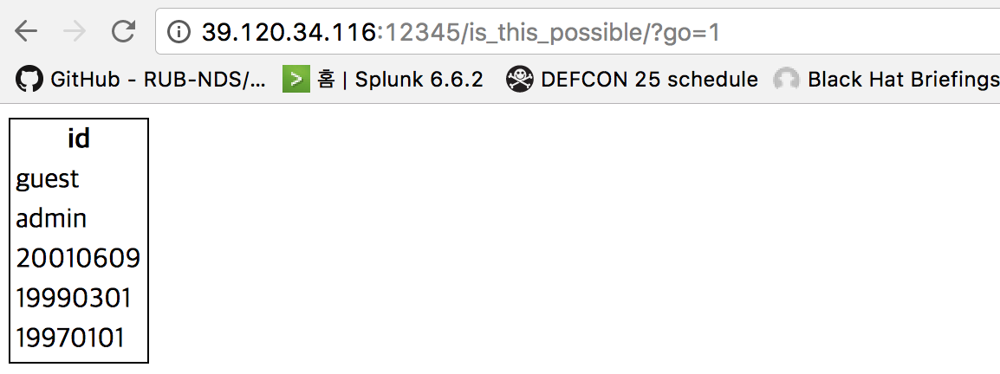

php 소스코드 문제는 아래와 같다.

.. code-block:: php

    <?php
        error_reporting(0);
        require_once 'config.php';
        if(isset($_GET['go'])){
            $filter = "/\'|\"|`|,|<|>|&|=|;|#|or|and|union|select|into|info|sc|in|like|regex|rand|limit|prob|0x|0b/i";
            if(preg_match($filter, $_GET['go']))
                exit("403 forbidden");
            if(preg_match("/\s/", $_GET['go']))
                exit("whitespace nono");
            $i = 0;
            $conn = mysqli_connect(DB_HOST, DB_USER, DB_PASSWORD, DB_NAME);
            $query = mysqli_query($conn, "SELECT * FROM `go` ORDER BY ".$_GET['go']." DESC");
            echo "<table style='border: 1px solid black;'>";
            echo "<tr><th>id</th></tr>";
            while($row = mysqli_fetch_array($query)){
                $res[$i++] = $row['id'];
                echo "<tr><td>{$row['id']}</td></tr>";
            }
            echo "</table>
";
            if($res[0] === "admin" && $res[1] === "19990301" && $res[2] === "guest"){
                if((int)$res[1] == $_GET['foo'] && strlen($_GET['foo']) > 10){
                    solve();
                }
            }
        }
        highlight_file(__FILE__); 
    ?>

문제를 볼 때 항상 입력값과 출력값을 염두해두자.
입력값은 go파라미터와 foo파라미터이고, 출력값은 solve()이다.

출력값인 solve()까지 가기 위해서는 입력한 값에 대한 조건문이 5개 맞아야 한다.

1) go 파라미터 입력값을 통한 출력값 첫번째 줄이 admin이어야 하고,
2) 출력값 두번째 줄이 19990301이어야 하고,
3) 출력값 세번째 줄이 guest여야 한다.
4) go 파라미터를 통한 출력값 두번째 줄을 int 적용할 경우, foo 파라미터 입력 값과 같아야 하며,
5) foo 파라미터의 스트링 길이는 10이상이어야 한다.

일단 go 파라미터에 1 값을 입력하고 어떻게 출력되는 지 확인한다.

다음과 같이 테이블이 출력된다. 해당 테이블을 위의 조건과 만족하도록 출력하여야 하는데, 많은 문자열을 preg_match로 필터링하고 있다.
admin, 19990301, guest 순으로 출력을 하기 위해서는 문자열 길이로 sorting해도 안되고, 문자정렬 순위로 sorting해도 불가능하다.
해당 문자열을 int값으로 출력하여 그 값을 비교하여 하나씩 sorting 하도록 하자.
sort by절에 go 파라미터가 끼어 있으므로, case 컬럼명 when 조건문 then 저장구간 else구문을 이용하여 하나씩  조건을 성립해나가도록 한다.

먼저 admin을 첫번째 줄에 출력하도록 한다. in이 문자열로 필터링되기 때문에 int값으로 비교하여 출력하도록 한다.

.. code-block:: sql

   case(hex(id)%2b0)when(61646)then(1)else(2)end

두번째 줄의 경우 19990301이 출력되도록 한다.

.. code-block:: sql

   case(hex(id)%2b0)when(61646)then(1)else(case(id)when(19990301)then(1)end)end

위에서 언급한 3가지 조건이 만족하였으며, foo 파라미터에 대한 2가지 조건을 만족해야한다.
문자열 길이가 10이고, int로 변환하였을 경우 19990301로 변환할 수 있는 방법은 소수점을 이용할 수 있다.

.. code-block:: sql

    19990301.00
    
모든 조건을 만족시켜 플래그를 획득할 수 있다.
